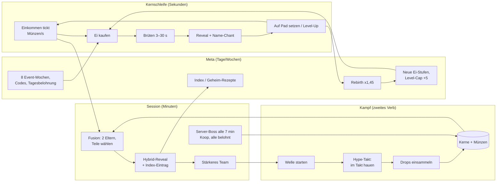

# FUSE THE BRAINROT – Game Design Document (Phase F)

**Projekt:** Fortnite-UEFN-Insel von Luis (Creator-Code „haske“) · **Stand:** 29.09.2026 · **Version:** GDD v1.0 (Release 1) · **Ziel-Release:** 08.–15.12.2026 (Soll: Do. 10.12.2026), Einreichung zur Review spätestens Sa. 05.12.2026
**Richtung (von Luis freigegeben):** „Fuse & Fight“ nach Red-Team-Review (`research_notes/.../red_team_review.md`, Abschnitt 3–4)
**Grundlage:** `reports/Brainrot Map Marktanalyse UEFN.md` (Phasen A–E), `red_team_review.md`, `uefn_feasibility.md`, `ip_rules_monetization.md`. Zahlen daraus werden als [Bericht A2], [RT §4], [Feas §8], [IP §2] zitiert.
**Begleitdateien (alle in `deliverables/data/`):**
- `brainrot_catalog.csv`: 88 Kreaturen (40 Basis, 40 Event, 8 Geheim)
- `hybrid_names.csv`: alle 1.000 Hybrid-Namen, gegen die Sperrliste geprüft
- `economy_sim.py` + `economy_sim_output.csv`: Wirtschaftssimulation
- `catalog_gen.py`: erzeugt Katalog, Namen und Tabellen

### Status-Legende für die Machbarkeit (gilt im ganzen Dokument)
- **VERIFIED:** Ein offizieller Epic-Auszug liegt vor ([Feas]-Tabelle).
- **LIKELY:** Die Quelle ist sekundär, das Forum oder mehrdeutig, oder es ist starkes Vorwissen.
- **UNVERIFIED:** Nicht belegt. Wird in Woche 1 geprüft. Jedes solche Element hat unten einen **Fallback**.

In Abschnitt 15 sind alle nicht-VERIFIED-Elemente noch einmal gesammelt.

### Die 12 Kernentscheidungen auf einen Blick
1. **Titel:** **FUSE THE BRAINROT**, Untertitel im Beschreibungstext „Hatch. Fuse. Fight.“
2. **Kern:** Eier ausbrüten, dann Einkommen auf dem eigenen Plot, dann zwei Brainrots zu einem Hybriden **fusionieren**, dann kämpfen die Hybride (Solo-Wellen und Koop-Server-Boss).
3. **Modularität:** 8 Arten mit je 3 Teilen (Kopf, Körper, Accessoire) ergeben **24 Teile**, also **512 sichtbare Kombinationen**. Seltenheit wird **nur über Material-Instanzen** dargestellt (7 Stufen), deshalb braucht es keine zusätzlichen Meshes.
4. **40 Basis-Kreaturen:** 8 Arten × 4 Standardformen (Klassik, Neon, Gold, Kristall) plus 8 Top-Formen (4 Legendär, 2 Mythisch, 2 Geheim).
5. **Technik:** Alle Teile sind **statische Meshes**, die pro Pad vorplatziert und nur ein- und ausgeblendet werden. Idle-Animation läuft über das **Material (World Position Offset)**, Angriffe über **Verse-`MoveTo`**. Es gibt kein Rigging, keine Skelett-Animation und keine zur Laufzeit gespawnten animierten Entities [RT §4].
6. **Aktives Spielerverb „Hype-Takt“:** Der Spieler schlägt im Takt mit der Spitzhacke (Feuer-Taste). Das gibt einen Multiplikator von ×1,0, ×1,25 oder ×1,5 auf den Team-Schaden. Die Kreaturen kämpfen, nicht der Spieler.
7. **Währungen:** Münzen (Soft), **Kerne** (aus Kämpfen, nötig für Fusion, verbinden also beide Verben), Event-Tokens. **Es gibt keine Premium-Währung.**
8. **Rebirth:** ×1,45 Einkommen und Kraft pro Rebirth (multiplikativ). Die erste Rebirth kommt im Median nach **2:25 h** (Simulation, 10 Seeds).
9. **Keine Verluste:** Eine Fusion ist nie ein Downgrade, verlorene Wellen und Bosse geben Trostpreise, und Überzähliges wird bei der Rebirth zu Kernen. **Es gibt kein Stehlen.**
10. **IIT:** Nur deterministische Angebote: 13 Angebote zwischen 150 und 900 V-Bucks. Es gibt keinen bezahlten Zufall, kein Glücksrad und keinen Zeitdruck.
11. **Live-Ops:** 8 Event-Wochen sind vorproduziert (10.12.2026–03.02.2027): 40 Event-Kreaturen, 16 Codes, 4 Boss-Varianten und 2 Bonus-Arten. Die Freischaltung ist datengetrieben.
12. **Feature-Freeze** am **So. 15.11.2026**. Die Kill-Kriterien stehen in Abschnitt 14.

---

## 1. Titel, Pitch, Spielerversprechen

### 1.1 Titeloptionen (Muster „VERB THE BRAINROT“)

| Option | Stärken | Schwächen | Bewertung |
|---|---|---|---|
| **FUSE THE BRAINROT** | Kurz (17 Zeichen), klares Verb und genau das Alleinstellungsmerkmal. Passt zum Thumbnail „A + B = C“. Keine Verwechslung mit „Fight The Brainrot“. | „Fuse Machine“ gibt es als Nebenmechanik schon woanders [RT §0]. Das Kampf-Verb steckt nicht im Titel. | **Gewählt** |
| FUSE & FIGHT THE BRAINROT | Nennt beide Verben | 25 Zeichen, im Discover-Tile schnell abgeschnitten. „FIGHT THE BRAINROT“ steckt als Teilstring drin, das wirkt nach Klon und riskiert Discover-Abwertung [Bericht B2, IP §2 Regel 1.9.1]. | verworfen |
| HATCH & FUSE THE BRAINROT | Ei-Hook | Rückt nah an „GROW THE BRAINROT“ (53K Peak, Ei-Aufzucht) [Bericht B2]. Kein Kampf im Titel. | verworfen |

**Entscheidung: FUSE THE BRAINROT.** Das Kampf-Verb transportieren Thumbnail und Beschreibung. **Thumbnail A:** Zwei Kreaturen links, ein „+“, rechts der leuchtende Hybrid, der gegen einen riesigen Boss-Schatten posiert. **Thumbnail B:** Ein Hybrid-Trio, das den Boss „König Kabelsalat“ haut. Beide Thumbnails laufen ab Tag 1 im A/B-Test [Bericht E5].

**Vor dem Publish prüfen:** Luis sucht auf fortnite.gg nach „Fuse the Brainrot“. Gibt es den Titel exakt schon, gilt der Ersatz **„FUSE THE BRAINROTS!“**.

**Metadaten-Regeln:** Die Wörter „XP“, „AFK“, „V-Bucks“ und „Coin farm“ sowie geschützte Figurennamen kommen nicht vor [IP §2]. Die Beschreibung spricht keine unter 13-Jährigen an.

### 1.2 Pitch (ein Satz)
> **Brüte verrückte Brainrots aus, fusioniere Kopf, Körper und Accessoire zu deinem eigenen Hybriden, und schick deine Kreationen gemeinsam mit dem ganzen Server gegen riesige Bosse in den Kampf.**

### 1.3 Spielerversprechen
1. **„Ich erschaffe etwas, das es so noch nicht gab.“** Jede Fusion zeigt vorher die Vorschau: Name, Look und Werte. 512 Kombinationen sind möglich, 8 davon sind geheime Rezepte.
2. **„Meine Wahl zählt.“** Der Kopf bringt den Angriff, der Körper die Werte, das Accessoire die Eigenschaft. Das spürt man in jeder Welle.
3. **„Ich verliere nie etwas.“** Es gibt keinen Diebstahl, keine Fusion verschlechtert etwas, und jeder Kampf gibt eine Belohnung.
4. **„Zusammen ist es größer.“** Alle 7 Minuten kommt ein Server-Boss. Wer mitmacht, bekommt die volle Belohnung.
5. **„Jeden Tag gibt es etwas Neues.“** Tagesbelohnung, Codes und jede Woche ein neues Event-Ei.

---

## 2. Spielschleifen

### 2.1 Kernschleife (Sekunden)
**Einkommen ticken sehen (1 s), dann kaufen oder upgraden (5–15 s), dann Ei brüten (3–30 s), dann Reveal (0,4–4 s), dann auf ein Pad setzen, dann wieder Einkommen ticken sehen.**

Parallel läuft der Kampf-Takt: Welle starten, alle 3 s im Takt hauen, Drops aufsammeln, Belohnung (Welle: 25 s Kampf plus ≈15 s Verwaltung).

### 2.2 Session-Schleife (Minuten)
1. **Alle 40–60 s:** eine Welle schaffen oder farmen. Das bringt **Kerne**.
2. **Alle 20 s bis 10 min** (je nach Seltenheit): eine Fusion starten, nach Ablauf der Fusionszeit folgt der Reveal.
3. **Alle 7 min:** Server-Boss. Das bringt ein Gratis-Ei, 90 s Einkommen und 10+ Kerne.
4. **Alle 20–40 min:** eine neue Ei-Stufe ist bezahlbar, ein Pad oder eine Totem-Stufe wird freigeschaltet.
5. **Pro Session:** Tagesbelohnung, Code-Terminal und Event-Aufgabe der Woche.

### 2.3 Meta-Schleife (Tage und Wochen)
- **Rebirth:** Die erste nach ≈2–3 h, danach alle 1–3 h. Jede Rebirth schaltet neue Ei-Stufen und ein höheres Level-Cap frei.
- **Index:** 40 Basis-Einträge, 504 Hybride, 8 Geheim-Rezepte und 40 Event-Einträge. Jeder Eintrag bringt +0,4 % Einkommen, gedeckelt bei +100 %.
- **Event-Kalender:** 8 Wochen, jede Woche ein Event-Ei mit 5 Event-Kreaturen, 2 Codes und einer Boss-Variante.
- **Ranglisten:** pro Server, dazu persönliche Bestwerte.

### 2.4 Zweites Verb: Kampf-Design (Kern, nicht Nebensache [RT §4])

**Grundsatz:** Die Kreaturen kämpfen automatisch. Der Spieler **dirigiert**: Er stellt das Team zusammen und baut über Fusion. Im Kampf schlägt er im **Hype-Takt** und sammelt Drops.

#### 2.4.1 Bewertete Optionen für das aktive Spielerverb

| Option | Spaß | Baubarkeit | Status | Entscheidung |
|---|---|---|---|---|
| **A. Hype-Takt mit der Spitzhacke** (Feuer-Taste im Rhythmus, über einen Input-Trigger-Device) | hoch: körperlich, Fortnite-typische Schlag-Animation gratis, auf allen Eingaben gleich | Input Trigger Device lauscht auf die Feuer-Aktion, Verse misst das Timing | **LIKELY** (Device existiert; ob „Fire“ als Eingabe wählbar ist, prüft der Spike in Woche 1) | **Gewählt** |
| B. UMG-Button „SMASH“ im Takt | mittel | UMG-Buttons mit Verse Fields sind **VERIFIED** [Feas §2] | VERIFIED | **Fallback 1** |
| C. Hype-Meter (8× tippen in 3 s füllt die Leiste) | mittel-niedrig | trivial, keine Timing-Latenz | VERIFIED (UMG) | **Fallback 2**, falls die Latenz das Timing unfair macht |
| D. Mit Fortnite-Waffe auf Gegner schießen | hoch | Eigene Gegner-Props müssten Schaden empfangen können: **UNVERIFIED**. Der Spieler würde zum Kämpfer, und das rückt gefährlich nah an „Fight The Brainrot“ [RT §3] | UNVERIFIED | verworfen |

#### 2.4.2 Hype-Takt: genaue Regeln
- **Ablauf:** Während einer Welle oder eines Bosses erscheint alle **3,0 s** ein **Takt-Ring** um das Fadenkreuz. Der Ring schrumpft in **1,2 s** auf den Zielkreis. Der Spieler drückt Feuer, also Spitzhacke schwingen: Maus links, R2/RT oder der Touch-Feuerknopf.
- **Fenster** (serverseitig gemessen, mit einer Latenz-Kompensation von +100 ms zum Zielzeitpunkt):
  - **Perfekt ±150 ms:** ×1,5 Team-Schaden für 3 s, Kreaturen machen einen „Smash-Lunge“.
  - **Gut ±350 ms:** ×1,25.
  - **Verfehlt oder kein Druck:** ×1,0.
  - Das Diskolama-Accessoire macht die Fenster um 20 % breiter.
- **Erwartungswert** in der Simulation: 20 % verfehlt, 50 % gut, 30 % perfekt, also Ø ×1,25.
- **Kein Spam-Vorteil:** Mehrfaches Drücken im Fenster zählt nur einmal, ein Druck außerhalb des Fensters bestraft nicht.
- **Latenz-Risiko: UNVERIFIED.** Der Takt-Ring wird per Verse-Field-Event im Client animiert, der Druck kommt am Server an.
  - **Messung in Woche 4:** Liegt bei 3 Testern der Anteil „Perfekt“ trotz Übung unter 15 %, werden die Fenster auf ±250/±500 ms verbreitert.
  - Hilft das nicht, gilt **Fallback 2** (Hype-Meter).

#### 2.4.3 Wellen (Solo, am eigenen Plot)
- **Start:** Der Spieler drückt den Welle-Knopf am Plot (Welt-Button und HUD-Knopf „KAMPF!“). Es gibt **keinen Autostart**, außer mit dem IIT-Komfort-Item „Auto-Welle“ für maximal 10 Wellen, danach ist wieder eine Eingabe nötig.
- **Team:** Die **3 Kreaturen mit der höchsten Kampfkraft (KK)** von den Pads kämpfen, der Spieler kann das Team manuell fixieren. Die übrigen Pad-Kreaturen jubeln (Hüpf-Animation, Idle ×2).
- **Gegner** („Glitch-Grummel“, eigene Figuren) kommen aus dem Portal am Plot-Ende und laufen **25 s** auf der Spur zum Plot-Kern:

| Gegner | Rolle | Anteil HP | Schwäche (Build-Crafting) |
|---|---|---|---|
| Staubfussel | Basis, Schwarm | 1× | Mehrfachtreffer / Kettenblitz (Tagliatakel, Wolkowal) |
| Kabelwurm | schnell (Laufzeit 18 s) | 0,6× | hohes Angriffstempo (Frogurko, Tagliatakel) |
| Dosenpanzer | tanky, greift Kreaturen an (Knockout 5 s bei HP < Treffer) | 3× | Burst/Krit (Razzopingu), Tank-Körper (Idrantoro) |
| Ploppblase | Schild, der erst nach 3 Treffern fällt | 1,5× | Mehrfachtreffer, Gift (Frogurko) |

- **Wellen-Aufbau:**
  - **Gegnerzahl:** `3 + floor(w/10)`, maximal 8. Das Pool-Maximum liegt bei 6 gleichzeitig sichtbaren Gegnern pro Plot, mehr kommen in Pulsen bei t = 0, 6 und 12 s.
  - **Jede 5. Welle** ist eine Tank-Welle.
  - **Jede 10. Welle** bringt einen Mini-Boss (Dosenpanzer ×3 Größe). Als Belohnung gibt es ein **Meilenstein-Ei** der höchsten freigeschalteten Stufe.
- **Formel:**
  - Wellenstärke `W(w) = 22 · 1,13^(w−1) · (1 + (w−1)/15)`
  - Gesamt-HP der Welle = `25 · W(w)`
  - Team-DPS = `Σ KK_i · Hype`. Die Welle ist gewonnen, wenn alle Gegner vor Ablauf von 25 s fallen, also wenn `Σ KK · Hype ≥ W(w)`.
- **Kampfkraft einer Kreatur:** `KK = Power_base[r] · 1,15^(L−1) · (1 + 0,08·Gen) · Rebirth-Mult`. Die Rollen-Faktoren der Art wirken als Multiplikator, siehe Arten-Tabelle.
- **Serverlast:** Der Kampf läuft als **abstrakte Simulation** in Verse mit einem Tick von **0,25 s** pro Plot. Treffer-Lunges werden nur als `MoveTo` gezeigt, höchstens 3 gleichzeitig pro Plot. Schadenszahlen erscheinen **nicht in der Welt** (UNVERIFIED), sondern als HUD-Combo-Zähler und Wellen-HP-Balken.

#### 2.4.4 Server-Boss (Koop, 1–16 Spieler)
- **Rhythmus:** Alle **7 min** (420 s), Dauer **75 s**.
  - **Ab T−60 s** läuft ein Countdown im HUD, ab T−10 s ertönt eine Glocke.
  - Neue Spieler können ab **8 min** Spielzeit teilnehmen. Vorher sehen sie den Boss, bekommen aber nur eine „Zuschauer-Kiste“ mit 30 s Einkommen.
- **Ort:** Der Boss (30–35 m hoch) landet in der **Hub-Arena** in der Inselmitte und ist von **allen 16 Plots aus sichtbar**, weil die Plots im Ring darum liegen.
  - Jedes Team kämpft **von seinem eigenen Plot aus**. Die Kreaturen feuern Hype-Strahlen (Niagara-Beam vom Pad zum Boss).
  - Es werden also keine zusätzlichen Kreatur-Props im Hub gebraucht.
- **Hype-Zone:** Wer zu Fuß oder per Teleporter in die Hub-Arena kommt (Ring mit 20–30 m Radius), macht **+25 % Schaden**. Das ist ein sozialer Magnet, aber keine Pflicht.
- **Boss-HP:** `HP = 60 s · Σ_Teilnehmer (KK_Team_i · 1,25)`. Die Berechnung passiert in den ersten 20 s neu, wenn jemand dazukommt. Solo ist deshalb genauso machbar wie zu 16.
- **Phasen:**
  - Bei 66 % und 33 % HP beginnt eine **„Sync-Smash“-Phase** von 8 s.
  - Erreichen **≥ 50 % der Teilnehmer** im selben Takt „Perfekt“, taumelt der Boss: ×2 Schaden für 5 s und ein großer Kamera-Shake für alle.
  - Solo reicht das eigene Perfekt.
- **Stampf-Angriff alle 10 s:** Er trifft die Kreatur mit den niedrigsten HP je Team. Liegen deren HP unter `0,3 × Ø-Team-HP`, fällt sie für 5 s aus. Tank-Körper zahlen sich also aus.
- **Belohnung für jeden Teilnehmer** (mindestens 1 Takt-Druck oder 20 s anwesend):
  - 90 s eigenes Einkommen
  - `10 + floor(Bosse/5)` Kerne, maximal 30
  - 1 **Boss-Ei** der höchsten freigeschalteten Stufe (Gratis-Zufall, Quoten sichtbar)
  - in Event-Wochen zusätzlich 20 Event-Tokens
- **Nicht besiegt:** Der Boss flieht, die Belohnung ist `max(60 %, HP-Abzug %)`. Es gibt **kein Nullsummen-Ranking**: Top-Schaden bringt nur eine kosmetische Krone für die Session.
- **Boss-Roster:** B1 **König Kabelsalat** (Kabelknoten mit Krone), B2 **Mikrowellora** (grimmige Mikrowelle auf Tentakel-Kabeln), B3 **Staubsauger-Baron** (Zylinderhut-Sauger). Die drei rotieren. Die Event-Varianten sind Material-Reskins (Abschnitt 7.4).

---

## 3. Die ersten 30 Sekunden, 5 Minuten und 30 Minuten

Die Zeitmarken stammen aus der Simulation (aktiver Spieler, Median aus 10 Seeds) und dem Tutorial-Skript. Echte Neulinge sind etwa 30–60 % langsamer. Die Tutorial-Pfeile sind darauf ausgelegt.

### 3.1 Die ersten 30 Sekunden

| Zeit | Spieler sieht | Spieler tut | Spieler bekommt |
|---|---|---|---|
| 0:00 | Ladebildschirm „FUSE THE BRAINROT“, dann Spawn auf **dem eigenen Plot** (Schild mit Name). Ein Nest glüht, ein großer 3D-Pfeil zeigt darauf. Toast: „Willkommen! Dein Plot.“ | – | Plot zugewiesen |
| 0:03 | Interaktions-Prompt „Starter-Ei öffnen“ (E / □ / Tippen) | interagiert | Das Ei wackelt, Brut-Balken 5 s |
| 0:08 | Das Ei bekommt Risse (3 Stufen), Trommelwirbel | schaut zu | Spannung |
| 0:10 | **Reveal:** WAFFELINO (skriptiert, Gewöhnlich). Staubwölkchen, TTS-Chant „Waf-fe-li-no!“, er hüpft auf Pad 1 | – | **Erste Kreatur (Belohnung < 30 s ✔)** |
| 0:12 | Über dem Pad schweben „+1“-Münzen, der Münzzähler oben links zählt hoch | – | 1,2 Münzen/s |
| 0:18 | Pfeil zum Ei-Automaten: „Wiesen-Ei – 20 🪙“ mit dem Balken „Noch 8 s“ | läuft hin (8 m) | – |
| 0:30 | Der Automat wird grün „Kaufen!“ | kauft das Wiesen-Ei | Ei im Nest (3 s) |

### 3.2 Die ersten 5 Minuten

| Zeit | Spieler sieht | Spieler tut | Spieler bekommt |
|---|---|---|---|
| 0:33 | Reveal der zweiten Kreatur (meist Gewöhnlich, 18 % Ungewöhnlich) | – | 2. Pad belegt |
| 0:40 | Der **KAMPF!**-Knopf pulsiert, 3 Staubfussel kriechen aus dem Portal | drückt KAMPF! | Tutorial-Welle 1 |
| 0:45 | Takt-Ring-Tutorial: „Hau im Takt!“ mit Zeitlupe beim ersten Ring | haut mit der Spitzhacke | „PERFEKT!“, Kreaturen smashen |
| 1:05 | Der Sieg-Banner zeigt „+50 🪙 +3 Kerne + Gratis-Ei“ | – | Kerne erstmals erklärt: „Kerne brauchst du für Fusionen“ |
| 1:05 | Pfeil zu Waffelino „Level-Up 20 🪙“ | Level-Up | **Erstes Upgrade (< 2 min ✔)**, Einkommen +15 % |
| 1:30 | Welle 2 (4 Gegner) | spielt | +Münzen, +Kerne |
| 2:00 | „Pad 3 freischalten – 150 🪙“ | schaltet frei | 3. Pad |
| 2:30 | Das Sumpf-Ei (350) leuchtet: „bessere Chancen!“ mit Quoten-Tabelle sichtbar | kauft | erstes Ungewöhnlich wahrscheinlich |
| 3:00 | Wellen 3 und 4 | spielt | Kerne ≥ 6 |
| 3:25 | Welle 5 geschafft, dann **Cutscene-light**: Die Fusions-Maschine fährt aus dem Boden (Kamera-Schwenk 1,5 s, nur für diesen Spieler als UMG-Overlay plus Welt-VFX) | – | Fusion freigeschaltet |
| 3:40 | Fusions-Screen: zwei Eltern wählen, dann **Teile wählen** (Kopf von A, Körper von B, Accessoire von A oder B). Live-Vorschau zeigt Name, Werte und Seltenheit | wählt | Vorschau „Frogafflelino“ oder ähnlich |
| 3:55 | „Fusionieren – 120 🪙 + 3 Kerne, 20 s“ | startet | Timer über der Maschine |
| 4:15–5:00 | **Fusions-Reveal:** Blitz, der Hybrid wird mit den Silben zusammengesetzt („Fro… waffe… lino!“), Index-Stempel „NEU!“ | setzt den Hybriden aufs Pad | **Erste Fusion (≈ 5 min ✔)**, Gen 1 (+8 %), Index +1 |

### 3.3 Die ersten 30 Minuten

| Zeit | Ereignis | Belohnung |
|---|---|---|
| 5–8 min | Welle 6–10, erste Tank-Welle (5). Totem Stufe 1–3 (+10 % je Stufe) | Meilenstein-Ei bei Welle 10 |
| ≈ 6 min | Erste **Episch**-Kreatur (Median 6:21, Spanne 6–20 min), meist aus Wüsten-Ei oder Resonanz | Lila-Wirbel-Reveal |
| 8:00 | Boss-Countdown erscheint: „KÖNIG KABELSALAT landet in 2:20“ | – |
| 9:00 | Tutorial-Hinweis „Lauf in die Hype-Zone: +25 % Schaden“, dazu ein Teleporter-Pad am Plot | – |
| **10:20** | **Erster Server-Boss (Ziel 10–15 min ✔).** Der Boss landet mit Schockwelle, alle 16 Plots schießen Strahlen. Sync-Smash-Phasen | 90 s Einkommen, 10 Kerne, Boss-Ei |
| 12–15 min | Pad 4 (3K), Wüsten-Ei (7,5K). Die Tagesbelohnung erscheint als Kalender-Popup, **erst jetzt**, damit das Tutorial nicht überladen wird | Tag-1-Belohnung |
| 15 min | Welle ≈ 22, ≈ 17K Münzen/s, 30+ Brainrots im Stall. Das Stall-Limit (30) wird erklärt: „Freilassen gibt Kerne“ | – |
| 17:20 | Boss 2 (Mikrowellora) | wie oben |
| 20 min | Code-Terminal-Hinweis im Hub: „Tipp einen Code ein!“ (Launch-Code „HALLOHASKE“) | Code-Belohnung |
| 24:30 | Boss 3 (Staubsauger-Baron) | – |
| 25–30 min | Disko-Ei (400K) als Sparziel. Index-Seite 1 halb voll, Geheim-Rezept-Seite zeigt „???“ | – |
| 30 min | Welle ≈ 45, 13M Münzen, Legendär für 25–60 % der Spieler. **Nächstes großes Ziel:** Rebirth-Fortschrittsbalken (300M + Welle 20) | – |

---

## 4. Brainrot-Katalog und Fusionssystem

### 4.1 Wie 40+ Basis-Kreaturen und das Teilesystem zusammenhängen

- **8 Arten, jede mit 3 Teilen:** Kopf **H1–H8**, Körper **K1–K8**, Accessoire **A1–A8**. Das sind **24 statische Meshes** und ergibt 8³ = **512 Kombinationen**.
  - Davon sind 8 „rein“ (alle drei Teile von derselben Art) und **504 Hybride**.
- **Seltenheit = Form:** Die Seltenheit wird **nicht** über neue Meshes dargestellt, sondern über **eine Material-Instanz je Seltenheit** (7 Formen): Klassik, Neon, Gold, Kristall, Königlich, Mythisch, Kosmisch. Jede der 512 Kombinationen kann daher jede Seltenheit tragen.
- **40 Basis-Kreaturen** sind die **reinen** Arten in den Seltenheiten, die aus Eiern schlüpfen können:
  - 8 Arten × Gewöhnlich, Ungewöhnlich, Selten und Episch ergibt 32.
  - Dazu kommen die Top-Formen **Legendär** für Art 1–4, **Mythisch** für Art 5–6 und **Geheim** für Art 7–8, zusammen 8.
  - Insgesamt sind es **40**, jede mit eigenem Namen.
  - Reine Legendär-Formen der Arten 5–8 gibt es **nur über Fusion**.
- **Event-Kreaturen (40):** Sie entstehen durch Event-Material-Instanzen (Frosti, Funki, Schleimi, Kosmi, Festi, Gründer) auf bestehenden Teilen, **ohne neue Meshes**. Nur die zwei **Bonus-Arten** (Paketeulo in W3, Bassotto in W6) bringen je 3 neue Teile. Sie sind **optional** und nur erlaubt, wenn die Speichermessung in Woche 1 unter 50 % liegt, sonst entfallen sie (Kill-Schalter).
- **Geheim-Rezepte (8):** 8 feste Kopf/Körper/Accessoire-Kombinationen aus zwei **mythischen** Eltern ergeben benannte Geheim-Hybride mit Spezialeffekt.

#### Speicherbudget (Plan, Messung in Woche 1 Pflicht [Feas §6])

| Posten | Menge | Budget je Einheit | Summe / Hinweis |
|---|---|---|---|
| Kreatur-Teile R1 | 24 Meshes | Kopf ≤ 1.500 Tris, Körper ≤ 2.500, Acc. ≤ 800; LOD1 50 %, LOD2 20 % (per Blender-Skript) | ≈ 38.400 Tris gesamt (LOD0) |
| Bonus-Arten (optional) | 6 Meshes | wie oben | +9.600 Tris |
| Texturen | **1 Paletten-Textur 256×64** für alle Kreaturen (Farbfelder, UVs werden per Skript auf Palettenzellen gelegt), 1 Noise 512² für Kristall/Kosmos, 24 UI-Teil-Icons 256² | – | winzig |
| Materialien | 1 Master-Material `M_Creature` (Palette, Rarity-Params, WPO-Bob, Fresnel, Emissive), 7 Rarity-MIs, 6 Event-MIs | – | – |
| Gegner / Bosse / Eier | 4 Gegner-Meshes, 3 Boss-Meshes (≤ 25K Tris, Nanite aus), 1 Ei-Mesh + 8 MIs | – | – |
| Instanzen | 16 Plots × 6 Pads × 24 Teile = **2.304** Teil-Props, dazu 16 × 24 Gegner-Props = 384, Drops 192, Deko ≈ 600 | – | **≈ 3.500 Props**. Das ist das eigentliche Risiko: Replikation und Server |
| **Ziel** | **≤ 45.000 von 100.000 Speicher-Einheiten** für alles Eigene, gemessen mit Launch Memory Calculation | – | Kill-Kriterium: Hochrechnung > 70 % [RT §4] |

**Fallback-Leiter, falls Speicher oder Performance knapp werden** (in dieser Reihenfolge):
1. 5 statt 6 Pads (−384 Props).
2. Max. 12 statt 16 Spieler.
3. Bonus-Arten streichen.
4. **Statt Pools:** statische Teil-Props zur Laufzeit per `SpawnProp` erzeugen (LIKELY). Das ist erlaubt, weil keine Skelett-Animation im Spiel ist. Der Forenbug betrifft nur Skelett-Animationen auf Laufzeit-Entities [Feas §3].

### 4.2 Seltenheitsstufen

| # | Seltenheit | Farbe (Hex) | Form / Material | Einkommen Basis (Münzen/s, L1) | Kraft Basis | Reveal-Dauer |
|---|---|---|---|---|---|---|
| 0 | Gewöhnlich | `#B8C2CC` | Klassik: mattes Plastik, Roughness 0,55 | 1 | 10 | 400 ms |
| 1 | Ungewöhnlich | `#5BD45B` | Neon: Emissive-Kanten (Fresnel 0,4) | 4 | 40 | 600 ms |
| 2 | Selten | `#3AA0FF` | Gold: Metallic 1,0, Roughness 0,25 | 16 | 160 | 900 ms |
| 3 | Episch | `#B056FF` | Kristall: halbtransparent (Masked/Dither), Fresnel lila | 70 | 700 | 1.400 ms |
| 4 | Legendär | `#FFB319` | Königlich: Gold + schwebende Krone (Niagara) | 320 | 3.200 | 2.200 ms |
| 5 | Mythisch | `#FF3D6E` | Mythisch: pinke Aura + Partikelschweif | 1.500 | 15.000 | 2.800 ms |
| 6 | Geheim | Verlauf `#00E5FF → #FF3DF2` auf `#0B0B14` | Kosmisch: Sternenfeld-Panning-Shader, Halo | 7.500 | 75.000 | 4.000 ms |

**Material-Tausch zur Laufzeit** (`SetMaterial` auf dem Prop oder der Mesh-Komponente): **LIKELY**.
**Fallback:** Die Seltenheit wird über einen Niagara-Aura-Ring am Pad und die Rahmenfarbe des Namensschilds gezeigt. Die Teile behalten dann ihr Klassik-Material.

### 4.3 Ei-Quoten (alle Eier gibt es nur für Münzen oder gratis; Quoten stehen immer im Ei-Automaten)

| Ei | Preis (Münzen) | Brutzeit | Quoten Gewöhnlich / Ungew. / Selten / Episch / Legendär / Mythisch / Geheim (%) | ab Rebirth |
|---|---|---|---|---|
| Wiesen-Ei | 20 | 3 s | 80 / 18 / 2 / 0 / 0 / 0 / 0 | 0 |
| Sumpf-Ei | 350 | 5 s | 40 / 42 / 15 / 3 / 0 / 0 / 0 | 0 |
| Wüsten-Ei | 7.50K | 8 s | 0 / 45 / 40 / 13 / 2 / 0 / 0 | 0 |
| Disko-Ei | 400K | 12 s | 0 / 0 / 50 / 38 / 11 / 1 / 0 | 0 |
| Gewitter-Ei | 3.00B | 18 s | 0 / 0 / 0 / 60 / 36 / 3.99 / 0.01 | 2 |
| Kosmos-Ei | 5.00T | 25 s | 0 / 0 / 0 / 0 / 70 / 29.95 / 0.05 | 5 |
| Urknall-Ei | 20.0Qa | 30 s | 0 / 0 / 0 / 0 / 55 / 44.8 / 0.2 | 9 |
| Galaxie-Ei | 100Sx | 30 s | 0 / 0 / 0 / 0 / 30 / 69.5 / 0.5 | 14 |
| Boss-Ei / Meilenstein-Ei / Tages-Ei | gratis | wie Stufe | Quoten der höchsten freigeschalteten Stufe | – |

- **Glücks-Zähler (Pity), sichtbar:** Pro Ei-Typ garantiert der **50. Schlupf** ohne die zweithöchste Stufe dieses Eis genau diese Stufe. Beispiel Wüsten-Ei: nach 49 Schlüpfen ohne Episch kommt garantiert Episch.
- **Art-Verteilung:** Innerhalb einer Seltenheit ist sie gleichverteilt über die Arten, die diese Seltenheit rein haben (Gewöhnlich bis Episch: 8 Arten; Legendär: Art 1–4; Mythisch: Art 5–6; Geheim: Art 7–8).
- **Event-Eier** kosten 100 Event-Tokens. Die Quoten stehen in Abschnitt 7.4.

### 4.4 Die 8 Arten (Teile, Rollen, Silben)

| # | Art | Konzept | Kopf → Skill | Körper → Profil | Accessoire → Trait | Silben P/M/S | Faktoren Eink./ATK/HP/Tempo |
|---|---|---|---|---|---|---|---|
| 1 | **Waffelino** | Waffeleisen-Maus (Verdiener) | Mauskopf mit Waffel-Ohren → Waffel-Wurf: Einzelziel, 1,2x ATK | aufklappbares Waffeleisen auf 4 Stummelbeinen → Waffel-Leib: Einkommen +20 % | Sirupflaschen-Rucksack → Sirup-Zins: +10 % Münzen aus Wellen | Waf/waffe/lino | 1.2/0.9/1.0/1.0 |
| 2 | **Frogurko** | Gurkenglas-Frosch (Gift) | Frosch-Gurkenkopf mit Glubschaugen → Essig-Spritzer: Gift 3 s (40 % ATK/s) | Einmachglas mit Froschbeinen → Glas-Leib: Angriffstempo +20 % | Dill-Krone → Dill-Duft: Gift hält +2 s | Fro/gurk/urko | 1.0/0.8/1.1/1.2 |
| 3 | **Idrantoro** | Hydranten-Stier (Tank) | Stierkopf mit Ventil-Hörnern → Wasser-Ansturm: Stoß + 0,5 s Betäubung | roter Hydranten-Rumpf, kurze Hufe → Hydranten-Leib: HP +60 % | Feuerwehrschlauch-Schal → Druckventil: 15 % Schaden zurück | Idra/dranto/oro | 0.85/0.7/1.6/0.8 |
| 4 | **Tagliatakel** | Nudel-Oktopus (Mehrfachtreffer) | Oktopuskopf mit Nudelnest-Frisur → Nudel-Wirbel: 3 Ziele, je 0,5x ATK | Pastateller-Mantel mit 8 Nudelarmen → Teller-Leib: Angriffstempo +40 % | Fleischbällchen-Kette → Bällchen-Kette: +1 Ziel | Tagli/glia/takel | 1.0/0.75/1.0/1.4 |
| 5 | **Diskolama** | Discokugel-Lama (Support) | Lamakopf mit Discokugel-Wuschel → Glitzer-Spucke: Team-ATK +15 % für 5 s | verspiegelter Wollkörper → Spiegel-Leib: ausgewogen | Plateau-Sonnenbrille → Plateau-Groove: Hype-Fenster +20 % breiter | Dis/disko/lama | 0.9/0.6/1.0/1.0 |
| 6 | **Razzopingu** | Raketen-Pinguin (Burst) | Pinguinkopf mit Pilotenbrille → Raketen-Rutscher: 25 % Krit-Chance | Raketenrumpf im Frack → Raketen-Leib: ATK +30 % | Düsen-Fliege → Nachbrenner: Krit-Schaden +50 % | Raz/razzo/pingu | 0.95/1.3/0.8/0.9 |
| 7 | **Wolkowal** | Gewitterwolken-Wal (Flächenschaden) | Walkopf aus Sturmwolke → Donner-Blas: Kettenblitz auf 4 Ziele | Wolkenleib mit Regen-Schleier → Nebel-Leib: 10 % Ausweichen | Regenbogen-Schirm → Farbschild: Boss-Schaden +20 % | Wol/wolko/wal | 1.05/1.0/1.1/0.7 |
| 8 | **Bzzkoffro** | Koffer-Hummel (Beute) | Hummelkopf mit Reisehut → Souvenir-Stich: +25 % Drop-Chance beim Treffer | Hartschalenkoffer mit Streifen → Koffer-Leib: Einkommen +10 % | Zoll-Sticker-Flügel → Zoll-Sticker: +1 Kern pro Welle (15 %) | Bzz/koff/offro | 1.1/0.8/1.0/1.1 |
| 9 | **Paketeulo** | Geschenkpaket-Eule (Geschenk, Event-Bonus W3) | Eulenkopf mit Schleife → Paket-Bombe: Flächenschaden 2 Ziele | Geschenkkarton mit Flügeln → Karton-Leib: HP +20 % | Geschenkband-Schwanz → Überraschung: 10 % Chance auf Gratis-Kern | Pake/paket/eulo | 1.05/0.9/1.2/0.9 |
| 10 | **Bassotto** | Lautsprecher-Dackel (Rhythmus, Event-Bonus W6) | Dackelkopf mit Kopfhörern → Bass-Drop: alle 3. Angriffe 2x Schaden | langer Lautsprecher-Körper → Boxen-Leib: Tempo +25 % | Subwoofer-Schwanz → Beat-Sync: Perfekt-Hype +10 % Schaden | Bas/basso/otto | 1.0/0.95/1.0/1.25 |

### 4.5 Die 40 Basis-Kreaturen (Release 1)

Kampfwerte auf Level 1, Gen 0, ohne Rebirth. Die Kampfkraft (KK) für die Wellenformel ist ≈ ATK × Angr./s × Rollenfaktor. Die vollständigen Felder (Herkunft, Skill, Trait) stehen in `brainrot_catalog.csv`.

| ID | Name | Konzept / Form | Silhouette (Kopf / Körper / Accessoire) | Seltenheit | Münzen/s (L1) | ATK / HP / Angr./s | Animation (prozedural) | Sound | Reveal |
|---|---|---|---|---|---|---|---|---|---|
| B01 | **Waffelino** | Waffeleisen-Maus (Verdiener); Form Klassik: mattes Plastik | Mauskopf mit Waffel-Ohren / aufklappbares Waffeleisen auf 4 Stummelbeinen / Sirupflaschen-Rucksack | Gewöhnlich | 1.2 | 9 / 50 / 1.0 | Klapp-Hüpfer: Körper-Squash 0,85/1,15 Y alle 0,6 s, Ohren wippen | Knusper-Klick + hohes Fiepen | Staubwölkchen weiß, 1 Pling (400 ms) |
| B02 | **Waffelinetto** | Waffeleisen-Maus (Verdiener); Form Neon: Neon-Emissive-Kanten | Mauskopf mit Waffel-Ohren / aufklappbares Waffeleisen auf 4 Stummelbeinen / Sirupflaschen-Rucksack | Ungewöhnlich | 4.8 | 36 / 200 / 1.0 | Klapp-Hüpfer: Körper-Squash 0,85/1,15 Y alle 0,6 s, Ohren wippen | Knusper-Klick + hohes Fiepen | Grüner Konfetti-Puff + Doppel-Pling (600 ms) |
| B03 | **Waffeloro** | Waffeleisen-Maus (Verdiener); Form Gold: Gold-Metallic | Mauskopf mit Waffel-Ohren / aufklappbares Waffeleisen auf 4 Stummelbeinen / Sirupflaschen-Rucksack | Selten | 19.2 | 144 / 800 / 1.0 | Klapp-Hüpfer: Körper-Squash 0,85/1,15 Y alle 0,6 s, Ohren wippen | Knusper-Klick + hohes Fiepen | Blauer Ring-Burst + Glocken-Arpeggio, leichter Kamera-Push (900 ms) |
| B04 | **Kristawaffel** | Waffeleisen-Maus (Verdiener); Form Kristall: Kristall-Fresnel, halbtransparent | Mauskopf mit Waffel-Ohren / aufklappbares Waffeleisen auf 4 Stummelbeinen / Sirupflaschen-Rucksack | Episch | 84.0 | 630 / 3500 / 1.0 | Klapp-Hüpfer: Körper-Squash 0,85/1,15 Y alle 0,6 s, Ohren wippen | Knusper-Klick + hohes Fiepen | Lila Wirbel, Ei bekommt Risse in 3 Stufen, Trommelwirbel (1.400 ms) |
| B05 | **Re Waffelissimo** | Waffeleisen-Maus (Verdiener); Form Königlich: Gold + schwebende Krone (VFX) | Mauskopf mit Waffel-Ohren / aufklappbares Waffeleisen auf 4 Stummelbeinen / Sirupflaschen-Rucksack | Legendär | 384.0 | 2880 / 16000 / 1.0 | Klapp-Hüpfer: Körper-Squash 0,85/1,15 Y alle 0,6 s, Ohren wippen | Knusper-Klick + hohes Fiepen | Goldener Lichtstrahl, 0,5 s Zeitlupe, Fanfare, Server-Toast (2.200 ms) |
| B06 | **Frogurko** | Gurkenglas-Frosch (Gift); Form Klassik: mattes Plastik | Frosch-Gurkenkopf mit Glubschaugen / Einmachglas mit Froschbeinen / Dill-Krone | Gewöhnlich | 1.0 | 8 / 55 / 1.2 | Frosch-Sprung: Hop 40 cm alle 1,4 s, Glas wackelt (Roll ±6°) | Quaken + Glas-Plopp | Staubwölkchen weiß, 1 Pling (400 ms) |
| B07 | **Frogurchetto** | Gurkenglas-Frosch (Gift); Form Neon: Neon-Emissive-Kanten | Frosch-Gurkenkopf mit Glubschaugen / Einmachglas mit Froschbeinen / Dill-Krone | Ungewöhnlich | 4.0 | 32 / 220 / 1.2 | Frosch-Sprung: Hop 40 cm alle 1,4 s, Glas wackelt (Roll ±6°) | Quaken + Glas-Plopp | Grüner Konfetti-Puff + Doppel-Pling (600 ms) |
| B08 | **Frogoldurko** | Gurkenglas-Frosch (Gift); Form Gold: Gold-Metallic | Frosch-Gurkenkopf mit Glubschaugen / Einmachglas mit Froschbeinen / Dill-Krone | Selten | 16.0 | 128 / 880 / 1.2 | Frosch-Sprung: Hop 40 cm alle 1,4 s, Glas wackelt (Roll ±6°) | Quaken + Glas-Plopp | Blauer Ring-Burst + Glocken-Arpeggio, leichter Kamera-Push (900 ms) |
| B09 | **Kristagurko** | Gurkenglas-Frosch (Gift); Form Kristall: Kristall-Fresnel, halbtransparent | Frosch-Gurkenkopf mit Glubschaugen / Einmachglas mit Froschbeinen / Dill-Krone | Episch | 70.0 | 560 / 3850 / 1.2 | Frosch-Sprung: Hop 40 cm alle 1,4 s, Glas wackelt (Roll ±6°) | Quaken + Glas-Plopp | Lila Wirbel, Ei bekommt Risse in 3 Stufen, Trommelwirbel (1.400 ms) |
| B10 | **Gurkönig Frogurkone** | Gurkenglas-Frosch (Gift); Form Königlich: Gold + schwebende Krone (VFX) | Frosch-Gurkenkopf mit Glubschaugen / Einmachglas mit Froschbeinen / Dill-Krone | Legendär | 320.0 | 2560 / 17600 / 1.2 | Frosch-Sprung: Hop 40 cm alle 1,4 s, Glas wackelt (Roll ±6°) | Quaken + Glas-Plopp | Goldener Lichtstrahl, 0,5 s Zeitlupe, Fanfare, Server-Toast (2.200 ms) |
| B11 | **Idrantoro** | Hydranten-Stier (Tank); Form Klassik: mattes Plastik | Stierkopf mit Ventil-Hörnern / roter Hydranten-Rumpf, kurze Hufe / Feuerwehrschlauch-Schal | Gewöhnlich | 0.85 | 7 / 80 / 0.8 | Stampf-Idle: 2 Stampfer + Dampfwolke alle 3 s | Tiefes Muhen + Zisch-Ventil | Staubwölkchen weiß, 1 Pling (400 ms) |
| B12 | **Idrantorino** | Hydranten-Stier (Tank); Form Neon: Neon-Emissive-Kanten | Stierkopf mit Ventil-Hörnern / roter Hydranten-Rumpf, kurze Hufe / Feuerwehrschlauch-Schal | Ungewöhnlich | 3.4 | 28 / 320 / 0.8 | Stampf-Idle: 2 Stampfer + Dampfwolke alle 3 s | Tiefes Muhen + Zisch-Ventil | Grüner Konfetti-Puff + Doppel-Pling (600 ms) |
| B13 | **Idrantoro Dorado** | Hydranten-Stier (Tank); Form Gold: Gold-Metallic | Stierkopf mit Ventil-Hörnern / roter Hydranten-Rumpf, kurze Hufe / Feuerwehrschlauch-Schal | Selten | 13.6 | 112 / 1280 / 0.8 | Stampf-Idle: 2 Stampfer + Dampfwolke alle 3 s | Tiefes Muhen + Zisch-Ventil | Blauer Ring-Burst + Glocken-Arpeggio, leichter Kamera-Push (900 ms) |
| B14 | **Kristidranto** | Hydranten-Stier (Tank); Form Kristall: Kristall-Fresnel, halbtransparent | Stierkopf mit Ventil-Hörnern / roter Hydranten-Rumpf, kurze Hufe / Feuerwehrschlauch-Schal | Episch | 59.5 | 490 / 5600 / 0.8 | Stampf-Idle: 2 Stampfer + Dampfwolke alle 3 s | Tiefes Muhen + Zisch-Ventil | Lila Wirbel, Ei bekommt Risse in 3 Stufen, Trommelwirbel (1.400 ms) |
| B15 | **Imperatoro Idrante** | Hydranten-Stier (Tank); Form Königlich: Gold + schwebende Krone (VFX) | Stierkopf mit Ventil-Hörnern / roter Hydranten-Rumpf, kurze Hufe / Feuerwehrschlauch-Schal | Legendär | 272.0 | 2240 / 25600 / 0.8 | Stampf-Idle: 2 Stampfer + Dampfwolke alle 3 s | Tiefes Muhen + Zisch-Ventil | Goldener Lichtstrahl, 0,5 s Zeitlupe, Fanfare, Server-Toast (2.200 ms) |
| B16 | **Tagliatakel** | Nudel-Oktopus (Mehrfachtreffer); Form Klassik: mattes Plastik | Oktopuskopf mit Nudelnest-Frisur / Pastateller-Mantel mit 8 Nudelarmen / Fleischbällchen-Kette | Gewöhnlich | 1.0 | 8 / 50 / 1.4 | Wabbel-Idle: Körper-Scale-Puls 1,0/1,08, Kette rotiert 30°/s | Schlürfen + Blubb | Staubwölkchen weiß, 1 Pling (400 ms) |
| B17 | **Tagliatakelino** | Nudel-Oktopus (Mehrfachtreffer); Form Neon: Neon-Emissive-Kanten | Oktopuskopf mit Nudelnest-Frisur / Pastateller-Mantel mit 8 Nudelarmen / Fleischbällchen-Kette | Ungewöhnlich | 4.0 | 30 / 200 / 1.4 | Wabbel-Idle: Körper-Scale-Puls 1,0/1,08, Kette rotiert 30°/s | Schlürfen + Blubb | Grüner Konfetti-Puff + Doppel-Pling (600 ms) |
| B18 | **Tagliatakel d'Oro** | Nudel-Oktopus (Mehrfachtreffer); Form Gold: Gold-Metallic | Oktopuskopf mit Nudelnest-Frisur / Pastateller-Mantel mit 8 Nudelarmen / Fleischbällchen-Kette | Selten | 16.0 | 120 / 800 / 1.4 | Wabbel-Idle: Körper-Scale-Puls 1,0/1,08, Kette rotiert 30°/s | Schlürfen + Blubb | Blauer Ring-Burst + Glocken-Arpeggio, leichter Kamera-Push (900 ms) |
| B19 | **Kristallotakel** | Nudel-Oktopus (Mehrfachtreffer); Form Kristall: Kristall-Fresnel, halbtransparent | Oktopuskopf mit Nudelnest-Frisur / Pastateller-Mantel mit 8 Nudelarmen / Fleischbällchen-Kette | Episch | 70.0 | 525 / 3500 / 1.4 | Wabbel-Idle: Körper-Scale-Puls 1,0/1,08, Kette rotiert 30°/s | Schlürfen + Blubb | Lila Wirbel, Ei bekommt Risse in 3 Stufen, Trommelwirbel (1.400 ms) |
| B20 | **Mamma Tagliatella** | Nudel-Oktopus (Mehrfachtreffer); Form Königlich: Gold + schwebende Krone (VFX) | Oktopuskopf mit Nudelnest-Frisur / Pastateller-Mantel mit 8 Nudelarmen / Fleischbällchen-Kette | Legendär | 320.0 | 2400 / 16000 / 1.4 | Wabbel-Idle: Körper-Scale-Puls 1,0/1,08, Kette rotiert 30°/s | Schlürfen + Blubb | Goldener Lichtstrahl, 0,5 s Zeitlupe, Fanfare, Server-Toast (2.200 ms) |
| B21 | **Diskolama** | Discokugel-Lama (Support); Form Klassik: mattes Plastik | Lamakopf mit Discokugel-Wuschel / verspiegelter Wollkörper / Plateau-Sonnenbrille | Gewöhnlich | 0.9 | 6 / 50 / 1.0 | Kopfnicken im 120-BPM-Takt, Kugel dreht 45°/s | Lama-Summen + Disco-Pling | Staubwölkchen weiß, 1 Pling (400 ms) |
| B22 | **Diskolamina** | Discokugel-Lama (Support); Form Neon: Neon-Emissive-Kanten | Lamakopf mit Discokugel-Wuschel / verspiegelter Wollkörper / Plateau-Sonnenbrille | Ungewöhnlich | 3.6 | 24 / 200 / 1.0 | Kopfnicken im 120-BPM-Takt, Kugel dreht 45°/s | Lama-Summen + Disco-Pling | Grüner Konfetti-Puff + Doppel-Pling (600 ms) |
| B23 | **Goldiskolama** | Discokugel-Lama (Support); Form Gold: Gold-Metallic | Lamakopf mit Discokugel-Wuschel / verspiegelter Wollkörper / Plateau-Sonnenbrille | Selten | 14.4 | 96 / 800 / 1.0 | Kopfnicken im 120-BPM-Takt, Kugel dreht 45°/s | Lama-Summen + Disco-Pling | Blauer Ring-Burst + Glocken-Arpeggio, leichter Kamera-Push (900 ms) |
| B24 | **Kristallama** | Discokugel-Lama (Support); Form Kristall: Kristall-Fresnel, halbtransparent | Lamakopf mit Discokugel-Wuschel / verspiegelter Wollkörper / Plateau-Sonnenbrille | Episch | 63.0 | 420 / 3500 / 1.0 | Kopfnicken im 120-BPM-Takt, Kugel dreht 45°/s | Lama-Summen + Disco-Pling | Lila Wirbel, Ei bekommt Risse in 3 Stufen, Trommelwirbel (1.400 ms) |
| B25 | **Diskolama Mythica** | Discokugel-Lama (Support); Form Mythisch: Pink-Aura + Partikelschweif | Lamakopf mit Discokugel-Wuschel / verspiegelter Wollkörper / Plateau-Sonnenbrille | Mythisch | 1350.0 | 9000 / 75000 / 1.0 | Kopfnicken im 120-BPM-Takt, Kugel dreht 45°/s | Lama-Summen + Disco-Pling | Pinke Schockwelle über den Plot, Chor-Akkord, Server-Toast + Name per TTS (2.800 ms) |
| B26 | **Razzopingu** | Raketen-Pinguin (Burst); Form Klassik: mattes Plastik | Pinguinkopf mit Pilotenbrille / Raketenrumpf im Frack / Düsen-Fliege | Gewöhnlich | 0.95 | 13 / 40 / 0.9 | Watschel-Idle (Roll ±8°) + Mini-Raketenhüpfer alle 4 s | Tröt + Zünd-Fauchen | Staubwölkchen weiß, 1 Pling (400 ms) |
| B27 | **Razzopinguino** | Raketen-Pinguin (Burst); Form Neon: Neon-Emissive-Kanten | Pinguinkopf mit Pilotenbrille / Raketenrumpf im Frack / Düsen-Fliege | Ungewöhnlich | 3.8 | 52 / 160 / 0.9 | Watschel-Idle (Roll ±8°) + Mini-Raketenhüpfer alle 4 s | Tröt + Zünd-Fauchen | Grüner Konfetti-Puff + Doppel-Pling (600 ms) |
| B28 | **Razzoro** | Raketen-Pinguin (Burst); Form Gold: Gold-Metallic | Pinguinkopf mit Pilotenbrille / Raketenrumpf im Frack / Düsen-Fliege | Selten | 15.2 | 208 / 640 / 0.9 | Watschel-Idle (Roll ±8°) + Mini-Raketenhüpfer alle 4 s | Tröt + Zünd-Fauchen | Blauer Ring-Burst + Glocken-Arpeggio, leichter Kamera-Push (900 ms) |
| B29 | **Kristazzo** | Raketen-Pinguin (Burst); Form Kristall: Kristall-Fresnel, halbtransparent | Pinguinkopf mit Pilotenbrille / Raketenrumpf im Frack / Düsen-Fliege | Episch | 66.5 | 910 / 2800 / 0.9 | Watschel-Idle (Roll ±8°) + Mini-Raketenhüpfer alle 4 s | Tröt + Zünd-Fauchen | Lila Wirbel, Ei bekommt Risse in 3 Stufen, Trommelwirbel (1.400 ms) |
| B30 | **Razzopingu Supremo** | Raketen-Pinguin (Burst); Form Mythisch: Pink-Aura + Partikelschweif | Pinguinkopf mit Pilotenbrille / Raketenrumpf im Frack / Düsen-Fliege | Mythisch | 1425.0 | 19500 / 60000 / 0.9 | Watschel-Idle (Roll ±8°) + Mini-Raketenhüpfer alle 4 s | Tröt + Zünd-Fauchen | Pinke Schockwelle über den Plot, Chor-Akkord, Server-Toast + Name per TTS (2.800 ms) |
| B31 | **Wolkowal** | Gewitterwolken-Wal (Flächenschaden); Form Klassik: mattes Plastik | Walkopf aus Sturmwolke / Wolkenleib mit Regen-Schleier / Regenbogen-Schirm | Gewöhnlich | 1.05 | 10 / 55 / 0.7 | Schwebe-Bob: Sinus 25 cm / 2,4 s, langsames Rollen | Walgesang + fernes Donnergrollen | Staubwölkchen weiß, 1 Pling (400 ms) |
| B32 | **Wolkowalino** | Gewitterwolken-Wal (Flächenschaden); Form Neon: Neon-Emissive-Kanten | Walkopf aus Sturmwolke / Wolkenleib mit Regen-Schleier / Regenbogen-Schirm | Ungewöhnlich | 4.2 | 40 / 220 / 0.7 | Schwebe-Bob: Sinus 25 cm / 2,4 s, langsames Rollen | Walgesang + fernes Donnergrollen | Grüner Konfetti-Puff + Doppel-Pling (600 ms) |
| B33 | **Wolkoro** | Gewitterwolken-Wal (Flächenschaden); Form Gold: Gold-Metallic | Walkopf aus Sturmwolke / Wolkenleib mit Regen-Schleier / Regenbogen-Schirm | Selten | 16.8 | 160 / 880 / 0.7 | Schwebe-Bob: Sinus 25 cm / 2,4 s, langsames Rollen | Walgesang + fernes Donnergrollen | Blauer Ring-Burst + Glocken-Arpeggio, leichter Kamera-Push (900 ms) |
| B34 | **Kristallwal** | Gewitterwolken-Wal (Flächenschaden); Form Kristall: Kristall-Fresnel, halbtransparent | Walkopf aus Sturmwolke / Wolkenleib mit Regen-Schleier / Regenbogen-Schirm | Episch | 73.5 | 700 / 3850 / 0.7 | Schwebe-Bob: Sinus 25 cm / 2,4 s, langsames Rollen | Walgesang + fernes Donnergrollen | Lila Wirbel, Ei bekommt Risse in 3 Stufen, Trommelwirbel (1.400 ms) |
| B35 | **Kosmowal Infinito** | Gewitterwolken-Wal (Flächenschaden); Form Kosmisch: Kosmos-Shader (Sternenfeld-Panning), Halo | Walkopf aus Sturmwolke / Wolkenleib mit Regen-Schleier / Regenbogen-Schirm | Geheim | 7875.0 | 75000 / 412500 / 0.7 | Schwebe-Bob: Sinus 25 cm / 2,4 s, langsames Rollen | Walgesang + fernes Donnergrollen | Blackout 300 ms, kosmischer Wirbel, Bass-Drop, globales Banner für alle 16 Spieler (4.000 ms) |
| B36 | **Bzzkoffro** | Koffer-Hummel (Beute); Form Klassik: mattes Plastik | Hummelkopf mit Reisehut / Hartschalenkoffer mit Streifen / Zoll-Sticker-Flügel | Gewöhnlich | 1.1 | 8 / 50 / 1.1 | Summ-Zittern 12 Hz ±1 cm + Flug-Bob 15 cm | Brummen + Reißverschluss-Zipp | Staubwölkchen weiß, 1 Pling (400 ms) |
| B37 | **Bzzkoffrino** | Koffer-Hummel (Beute); Form Neon: Neon-Emissive-Kanten | Hummelkopf mit Reisehut / Hartschalenkoffer mit Streifen / Zoll-Sticker-Flügel | Ungewöhnlich | 4.4 | 32 / 200 / 1.1 | Summ-Zittern 12 Hz ±1 cm + Flug-Bob 15 cm | Brummen + Reißverschluss-Zipp | Grüner Konfetti-Puff + Doppel-Pling (600 ms) |
| B38 | **Bzzoro Kofferone** | Koffer-Hummel (Beute); Form Gold: Gold-Metallic | Hummelkopf mit Reisehut / Hartschalenkoffer mit Streifen / Zoll-Sticker-Flügel | Selten | 17.6 | 128 / 800 / 1.1 | Summ-Zittern 12 Hz ±1 cm + Flug-Bob 15 cm | Brummen + Reißverschluss-Zipp | Blauer Ring-Burst + Glocken-Arpeggio, leichter Kamera-Push (900 ms) |
| B39 | **Kristabzz** | Koffer-Hummel (Beute); Form Kristall: Kristall-Fresnel, halbtransparent | Hummelkopf mit Reisehut / Hartschalenkoffer mit Streifen / Zoll-Sticker-Flügel | Episch | 77.0 | 560 / 3500 / 1.1 | Summ-Zittern 12 Hz ±1 cm + Flug-Bob 15 cm | Brummen + Reißverschluss-Zipp | Lila Wirbel, Ei bekommt Risse in 3 Stufen, Trommelwirbel (1.400 ms) |
| B40 | **Galaktikoffro** | Koffer-Hummel (Beute); Form Kosmisch: Kosmos-Shader (Sternenfeld-Panning), Halo | Hummelkopf mit Reisehut / Hartschalenkoffer mit Streifen / Zoll-Sticker-Flügel | Geheim | 8250.0 | 60000 / 375000 / 1.1 | Summ-Zittern 12 Hz ±1 cm + Flug-Bob 15 cm | Brummen + Reißverschluss-Zipp | Blackout 300 ms, kosmischer Wirbel, Bass-Drop, globales Banner für alle 16 Spieler (4.000 ms) |

### 4.6 Fusionsregeln

**Eingang:** 2 Brainrots aus Pad oder Stall. Die Fusion kostet `120 × Einkommen_Basis[r] × Rebirth-Mult` Münzen plus Kerne je Eltern-Seltenheit (3 / 6 / 12 / 25 / 50 / 100) und dauert 20 s / 45 s / 90 s / 3 min / 6 min / 10 min. Es gibt einen Fusions-Slot, einen zweiten per IIT.

**Welche Teile woher? Der Spieler wählt, das ist das Build-Crafting:**
- **Kopf:** von A oder B. Er bestimmt den **Skill** (aktiver Angriff).
- **Körper:** von A oder B. Er bestimmt das **Profil** (HP, Tempo, Einkommensfaktor) und die **Animation**.
- **Accessoire:** von A oder B. Es bestimmt den **Trait** (passive Eigenschaft).
- **Standardvorschlag** (vorausgewählt): pro Slot automatisch das Teil mit dem höheren Wert für das gewählte Ziel „Einkommen“ oder „Kampf“ (Umschalter).
- Weil die Eltern selbst Hybride sein können, stehen bis zu 6 verschiedene Teile zur Wahl.

**Seltenheit des Ergebnisses:**
- **Ungleiche Seltenheit:** Das Ergebnis hat die **höhere** Seltenheit, dazu Gen +1. **Nie ein Downgrade.**
- **Gleiche Seltenheit bis Episch/Legendär:** **Resonanz:** **20 %** Chance auf Seltenheit +1.
  - Pity: Der 5. Versuch in Folge ist garantiert. Der Zähler „Resonanz 3/5“ ist sichtbar. Es ist ein Gratis-Zufall mit offengelegter Quote.
- **Maximum per Resonanz ist Mythisch.** Geheim gibt es **nur** über Geheim-Rezepte (Abschnitt 4.8) oder die winzigen Ei-Quoten.

**Werte des Ergebnisses:**
- **Level** = `max(Level A, Level B)`
- **Generation** = `max(Gen A, Gen B) + 1`, gedeckelt bei 10. Jede Generation bringt +8 % Einkommen und Kraft.
- **Trait-Vererbung:** Nur das gewählte Accessoire zählt. Ab **Gen 5** kommt ein **Neben-Trait** hinzu: das Accessoire des *anderen* Elternteils mit 50 % Stärke. Das ist ein Grund, tief zu fusionieren.
- **Einkommen** = `Einkommen_Basis[r] × Körper-Einkommensfaktor × 1,15^(L−1) × (1 + 0,08·Gen)`
- **ATK** = `Kraft_Basis[r] × Kopf-ATK-Faktor × …`
- **HP** = `Kraft_Basis[r] × 5 × Körper-HP-Faktor × …`
- **Tempo** = Körper-Tempofaktor

**Fusions-Vorschau (Pflicht):** Name, 3D-Teil-Icons, alle Werte, Seltenheits-Chancen („20 % Resonanz → Episch“) und die Info „Index: NEU!“ stehen **vor** dem Bestätigen fest.

### 4.7 Namensgenerator (Silben-Mix)

**Algorithmus** (vorberechnet per `catalog_gen.py`, in Verse nur als Tabellen-Lookup; alle Namen in `hybrid_names.csv`):
1. `Name = Präfix(Kopf-Art) ⊕ Mitte(Körper-Art) ⊕ Suffix(Accessoire-Art)`
2. **Verbindung ⊕:**
   - Konsonant + Konsonant: Bindevokal **„a“** einfügen.
   - Vokal + Vokal: den ersten Vokal des rechten Teils streichen.
   - Dreifach-Buchstaben werden gekappt.
   - Am Ende gilt Großschreibung am Anfang.
3. Bei **reinen** Kombinationen (alle Teile von derselben Art) gilt der Artname beziehungsweise der Basis-Name der Seltenheit.
4. **Titel-Präfix** nach Seltenheit ab Legendär (nur Anzeige): „Gran“ (Legendär), „Mythico“ (Mythisch), „Kosmico“ (Geheim).
5. **Sperrliste:** Jeder Name wird beim Generieren gegen die Sperrliste in Anhang A geprüft. **Ergebnis:** 0 Treffer bei 1.000 Namen. Die Länge liegt bei **8–16 Zeichen** (Median 13), das passt in das UI-Namensfeld mit 16 Zeichen bei 3,2 % Schrifthöhe.
6. **TTS-Chant:** 30 Silben-Samples (10 Arten × Präfix/Mitte/Suffix), vorab per Kokoro gerendert. Verse spielt 3 Audio-Player nacheinander ab (Abstand 180 ms), sodass sich der Name „zusammensingt“.

| Kopf + Körper + Accessoire | Ergebnis |
|---|---|
| Razzopingu + Frogurko + Diskolama | **Razagurkalama** |
| Wolkowal + Idrantoro + Waffelino | **Woladrantolino** |
| Waffelino + Bzzkoffro + Tagliatakel | **Wafakoffatakel** |
| Diskolama + Razzopingu + Wolkowal | **Disarazzowal** |
| Frogurko + Tagliatakel + Bzzkoffro | **Frogliaffro** |
| Idrantoro + Waffelino + Razzopingu | **Idrawaffepingu** |
| Bzzkoffro + Wolkowal + Frogurko | **Bzzawolkorko** |
| Tagliatakel + Diskolama + Idrantoro | **Taglidiskoro** |

### 4.8 Geheime und besondere Fusionen

| ID | Name | Kopf + Körper + Accessoire | Spezialeffekt |
|---|---|---|---|
| G01 | **Blitzodisko Supremo** | Kopf Wolkowal + Körper Diskolama + Acc. Razzopingu | Donner-Disco: Kettenblitz trifft im Takt, jeder 4. Blitz 3x |
| G02 | **Nudelnebel Infinito** | Kopf Tagliatakel + Körper Wolkowal + Acc. Frogurko | Nebel-Nudeln: alle Gegner vergiftet + 10 % langsamer |
| G03 | **Kofferkanone Magnifica** | Kopf Bzzkoffro + Körper Razzopingu + Acc. Idrantoro | Koffer-Rakete: Boss-Treffer werfen 2 Extra-Kerne aus |
| G04 | **Sirupsturm Galattico** | Kopf Waffelino + Körper Wolkowal + Acc. Diskolama | Sirup-Regen: Team-Einkommen +25 % während Wellen |
| G05 | **Hydrodisko Grandioso** | Kopf Idrantoro + Körper Diskolama + Acc. Tagliatakel | Schaum-Party: Team-HP +30 %, Dornen 25 % |
| G06 | **Gurkenrakete Fantastica** | Kopf Frogurko + Körper Razzopingu + Acc. Bzzkoffro | Essig-Jet: Krit-Treffer vergiften (100 % ATK/s) |
| G07 | **Walwaffel Celestiale** | Kopf Wolkowal + Körper Waffelino + Acc. Bzzkoffro | Himmelswaffel: +1 Pad-Einkommenseffekt auf alle Nachbarn (+10 %) |
| G08 | **Pinguinudel Assoluta** | Kopf Razzopingu + Körper Tagliatakel + Acc. Wolkowal | Raketen-Wirbel: Mehrfachtreffer auf 5 Ziele mit Krit |

- **Bedingung:** Beide Eltern sind **Mythisch**, und die gewählten Teile ergeben exakt das Rezept. Dann ist das Ergebnis **garantiert Geheim** (Einkommen und Kraft ×1,25 gegenüber normalem Geheim, dazu ein Spezialeffekt).
- **Hinweise im Index:**
  - Ab Rebirth 10 erscheint alle 2 Rebirths ein Teil-Hinweis („??? + Diskolama-Körper + ???“).
  - Codes aus Woche 4 und 8 geben je einen vollen Hinweis.
  - Das Event „Fusions-Festival“ (W8) zeigt alle Hinweise.
- **Weitere Besonderheiten:**
  - **Reinheits-Bonus:** Alle 3 Teile von derselben Art bringen +10 % auf den Rollen-Wert der Art.
  - **Spiegel-Fusion:** Zwei identische Kombinationen fusioniert bringen den garantierten Neben-Trait sofort, auch vor Gen 5.
  - **Regenbogen-Hybrid:** Alle 3 Teile von 3 verschiedenen Arten *und* Gen ≥ 7 ergeben einen kosmetischen Regenbogen-Schimmer (Material-Parameter).

### 4.9 Neue Kreaturen pro vorproduzierter Event-Woche

5 Event-Kreaturen pro Woche, 40 insgesamt, alle schon im Release-Build. Sie werden per Kalender freigeschaltet (Abschnitt 7.4). Die Stats entsprechen der normalen Seltenheit. Event-Formen sind **kosmetisch plus Index-Eintrag**, es gibt **keine Power-Inflation**.

| ID | Name | Woche | Art | Seltenheit | Münzen/s (L1) | ATK / HP |
|---|---|---|---|---|---|---|
| E1-01 | Gründer-Waffelino | W1 10.–16.12.2026 | Waffelino | Selten | 19.2 | 144 / 800 |
| E1-02 | Gründer-Frogurko | W1 10.–16.12.2026 | Frogurko | Selten | 16.0 | 128 / 880 |
| E1-03 | Gründer-Diskolama | W1 10.–16.12.2026 | Diskolama | Episch | 63.0 | 420 / 3500 |
| E1-04 | Gründer-Razzopingu | W1 10.–16.12.2026 | Razzopingu | Episch | 66.5 | 910 / 2800 |
| E1-05 | Gründer-Bzzkoffro | W1 10.–16.12.2026 | Bzzkoffro | Legendär | 352.0 | 2560 / 16000 |
| E2-06 | Frosti-Idrantoro | W2 17.–23.12.2026 | Idrantoro | Selten | 13.6 | 112 / 1280 |
| E2-07 | Frosti-Tagliatakel | W2 17.–23.12.2026 | Tagliatakel | Selten | 16.0 | 120 / 800 |
| E2-08 | Frosti-Wolkowal | W2 17.–23.12.2026 | Wolkowal | Episch | 73.5 | 700 / 3850 |
| E2-09 | Frosti-Waffelino | W2 17.–23.12.2026 | Waffelino | Episch | 84.0 | 630 / 3500 |
| E2-10 | Frosti-Diskolama | W2 17.–23.12.2026 | Diskolama | Legendär | 288.0 | 1920 / 16000 |
| E3-11 | Paketeulo | W3 24.–30.12.2026 | Paketeulo | Ungewöhnlich | 4.2 | 36 / 240 |
| E3-12 | Paketeuletto | W3 24.–30.12.2026 | Paketeulo | Selten | 16.8 | 144 / 960 |
| E3-13 | Paketeuloro | W3 24.–30.12.2026 | Paketeulo | Episch | 73.5 | 630 / 4200 |
| E3-14 | Kristapaketeulo | W3 24.–30.12.2026 | Paketeulo | Legendär | 336.0 | 2880 / 19200 |
| E3-15 | Paketeulo Mythico | W3 24.–30.12.2026 | Paketeulo | Mythisch | 1575.0 | 13500 / 90000 |
| E4-16 | Funki-Razzopingu | W4 31.12.–06.01.2027 | Razzopingu | Selten | 15.2 | 208 / 640 |
| E4-17 | Funki-Bzzkoffro | W4 31.12.–06.01.2027 | Bzzkoffro | Selten | 17.6 | 128 / 800 |
| E4-18 | Funki-Frogurko | W4 31.12.–06.01.2027 | Frogurko | Episch | 70.0 | 560 / 3850 |
| E4-19 | Funki-Idrantoro | W4 31.12.–06.01.2027 | Idrantoro | Legendär | 272.0 | 2240 / 25600 |
| E4-20 | Funki-Diskolama | W4 31.12.–06.01.2027 | Diskolama | Mythisch | 1350.0 | 9000 / 75000 |
| E5-21 | Schleimi-Frogurko | W5 07.–13.01.2027 | Frogurko | Selten | 16.0 | 128 / 880 |
| E5-22 | Schleimi-Tagliatakel | W5 07.–13.01.2027 | Tagliatakel | Episch | 70.0 | 525 / 3500 |
| E5-23 | Schleimi-Waffelino | W5 07.–13.01.2027 | Waffelino | Episch | 84.0 | 630 / 3500 |
| E5-24 | Schleimi-Wolkowal | W5 07.–13.01.2027 | Wolkowal | Legendär | 336.0 | 3200 / 17600 |
| E5-25 | Schleimi-Idrantoro | W5 07.–13.01.2027 | Idrantoro | Mythisch | 1275.0 | 10500 / 120000 |
| E6-26 | Bassotto | W6 14.–20.01.2027 | Bassotto | Ungewöhnlich | 4.0 | 38 / 200 |
| E6-27 | Bassottetto | W6 14.–20.01.2027 | Bassotto | Selten | 16.0 | 152 / 800 |
| E6-28 | Bassottoro | W6 14.–20.01.2027 | Bassotto | Episch | 70.0 | 665 / 3500 |
| E6-29 | Kristabassotto | W6 14.–20.01.2027 | Bassotto | Legendär | 320.0 | 3040 / 16000 |
| E6-30 | Bassotto Mythico | W6 14.–20.01.2027 | Bassotto | Mythisch | 1500.0 | 14250 / 75000 |
| E7-31 | Kosmi-Diskolama | W7 21.–27.01.2027 | Diskolama | Episch | 63.0 | 420 / 3500 |
| E7-32 | Kosmi-Bzzkoffro | W7 21.–27.01.2027 | Bzzkoffro | Episch | 77.0 | 560 / 3500 |
| E7-33 | Kosmi-Idrantoro | W7 21.–27.01.2027 | Idrantoro | Legendär | 272.0 | 2240 / 25600 |
| E7-34 | Kosmi-Waffelino | W7 21.–27.01.2027 | Waffelino | Mythisch | 1800.0 | 13500 / 75000 |
| E7-35 | Kosmi-Razzopingu | W7 21.–27.01.2027 | Razzopingu | Geheim | 7125.0 | 97500 / 300000 |
| E8-36 | Festi-Tagliatakel | W8 28.01.–03.02.2027 | Tagliatakel | Episch | 70.0 | 525 / 3500 |
| E8-37 | Festi-Wolkowal | W8 28.01.–03.02.2027 | Wolkowal | Episch | 73.5 | 700 / 3850 |
| E8-38 | Festi-Frogurko | W8 28.01.–03.02.2027 | Frogurko | Legendär | 320.0 | 2560 / 17600 |
| E8-39 | Festi-Diskolama | W8 28.01.–03.02.2027 | Diskolama | Mythisch | 1350.0 | 9000 / 75000 |
| E8-40 | Festi-Bzzkoffro | W8 28.01.–03.02.2027 | Bzzkoffro | Geheim | 8250.0 | 60000 / 375000 |

---

## 5. Wirtschaft

### 5.1 Währungen

| Währung | Symbol / Farbe | Zweck | Persistenz |
|---|---|---|---|
| **Münzen** | 🪙 `#FFC93C` | Eier, Level-Ups, Totem, Pads, Fusion (Anteil), Rebirth-Schwelle | wird bei Rebirth zurückgesetzt |
| **Kerne** | ◆ `#3EF2D6` | Fusion (Pflicht), Event-Tausch 10 Kerne = 1 Token (max. 50/Tag) | bleibt |
| **Event-Tokens** (je Woche eigenes Motiv: Schneeflocke, Paket, Funke …) | `#FF7AE0` | Event-Eier (100 Stück), Event-Deko | Nach Wochenende werden Reste 1:5 in Kerne getauscht |
| **Rebirth-Sterne** (Anzeige, keine Währung) | ★ | Zählen Rebirths, Titel | bleibt |

**Es gibt bewusst keine Premium-Währung.** IIT kauft direkt Items (Abschnitt 9). Dadurch lässt sich nichts „rückwärts“ in Zufall umwandeln.

### 5.2 Quellen und Senken

| Quelle | Menge | Senke | Menge |
|---|---|---|---|
| Pad-Einkommen | Σ Pad-Kreaturen × Totem × Rebirth × Index | Eier | 20 → 100 Sx (8 Stufen) |
| Welle, Erstabschluss | 45 s Einkommen + `20·1,12^w` Münzen; `2 + floor(w/10)` Kerne | Level-Up | `Einkommen_Basis[r]·20·1,21^(L−1)` |
| Welle, Wiederholung/Farmen | 15 s Einkommen + 1 Kern | Totem | `500·1,55^n` (+10 % je Stufe) |
| Server-Boss | 90 s Einkommen, 10–30 Kerne, 1 Boss-Ei | Pads 3–6 | 150 / 3K / 60K / 1,2M (bleiben bei Rebirth) |
| Meilenstein-Ei alle 10 Wellen | 1 Ei der höchsten Stufe | Fusion | Münzen + 3–100 Kerne |
| Freilassen | 1 / 1 / 2 / 3 / 5 / 8 / 12 Kerne je Seltenheit | Rebirth | `300M·4,25^n` Münzen (+ Welle ≥ 20+10n) |
| Tagesbelohnung, Codes | Kapitel 7 | Event-Eier | 100 Tokens |
| Rebirth-Rest | Überzählige Brainrots werden zu Kernen | – | – |

### 5.3 Formeln und Wachstum

- **Einkommen/s** = `Σ_Pads [Einkommen_Basis[r] · Artfaktor · 1,15^(L−1) · (1+0,08·Gen)] · (1 + 0,10·Totem) · 1,45^Rebirths · (1 + min(1,0; 0,004·Index))`
- **Level-Cap** = `25 + 5·Rebirths`, maximal 150.
  - Die Level-Kosten wachsen mit ×1,21 pro Level, der Nutzen mit ×1,15. Die Amortisation steigt dadurch von ≈ 2,2 min (L1) auf ≈ 7,5 min (L25). Das ist der eingebaute Bremsklotz.
- **Wellenstärke** `W(w) = 22 · 1,13^(w−1) · (1+(w−1)/15)`
- **Rebirth-Kosten** `= 300M · 4,25^n`. Voraussetzung **Welle ≥ 20 + 10n**, damit das Kampf-Verb Pflicht bleibt.
- **Ei-Preiskurve:** Jede Stufe kostet grob das 17- bis 4.000-Fache der vorigen. Die Stufen ab Gewitter-Ei sind an Rebirths gebunden (2 / 5 / 9 / 14). Faustregel: Ein neues Ei ist **5–15 min Einkommen** zum Zeitpunkt der Freischaltung.

### 5.4 Zahlenformat

- 3 signifikante Stellen mit Suffix: `999` · `1.00K` · `7.50K` · `17.0K` · `100K` · `1.00M` · … mit den Suffixen **K, M, B, T, Qa, Qi, Sx, Sp, Oc, No, Dc, Ud, Dd, Td, Qad, Qid, Sxd, Spd, Ocd, Nod, Vg** (bis 10⁶³).
- In Verse ist das eine Funktion `FormatBig(X:float):string`, 1:1 portiert von `fmt()` in `economy_sim.py`.
- **Dezimaltrennzeichen:** Der Punkt ist international lesbar. Die Sprache der Insel ist Englisch plus Deutsch, siehe Abschnitt 10. Die Suffixe gelten in allen Sprachen.
- Die Anzeige tickt mit 10 Hz über Interpolation. Der Server sendet den Stand nur 1× pro Sekunde (Verse-Field-Update).

### 5.5 Inflationsbremsen

1. **Belohnungen sind an Einkommen gekoppelt, nicht absolut:** Welle 15–45 s, Boss 90 s. Sie können deshalb nie „Jahre Einkommen“ ausschütten.
2. **Level-Kosten wachsen schneller als der Level-Nutzen** (1,21 gegen 1,15), dazu gilt das Cap.
3. **Die Rebirth setzt Münzen, Level und Totem zurück**, ihre Kosten wachsen ×4,25 bei nur ×1,45 Nutzen.
4. **Der Index-Bonus ist gedeckelt** (+100 %). Die Generation ist gedeckelt (Gen 10 = +80 %).
5. **Resonanz** geht nur bis Mythisch. Geheim ist rezeptgebunden.
6. **Kerne** entstehen nur aus aktiven Handlungen (Kampf, Boss, Freilassen), und die Kern-Kosten verdoppeln sich je Seltenheit.
7. **Event-Kreaturen** haben normale Stats, es gibt keinen Event-Power-Creep.
8. **IIT-Multiplikatoren sind additiv und gedeckelt.** Münz-Magnet (+100 %) und Münz-Rausch (+50 %) ergeben zusammen maximal ×2,5 auf Pad-Münzen. Auf Kerne, Kampfkraft, Rebirth-Kosten oder Quoten wirken sie nicht.

### 5.6 Rebirth / Prestige

- **Voraussetzung:** Münzen ≥ `300M·4,25^n` **und** höchste Welle ≥ `20+10n`. Im HUD läuft ein Fortschrittsbalken ab 25 %.
- **Behält:**
  - Index
  - Pads
  - Kerne
  - höchste Welle (für Ranglisten)
  - die **min(1+n, 6) stärksten Brainrots** (Level 1, Gen bleibt)
  - IIT-Items
  - Kosmetik
- **Zurückgesetzt:** Münzen, Level und Totem. **Übrige Brainrots werden automatisch zu Kernen** (Freilassen-Wert), **nichts verfällt ersatzlos**.
- **Gewinn:**
  - ×1,45 Einkommen **und** Kampfkraft, multiplikativ
  - Level-Cap +5
  - neue Ei-Stufen bei Rebirth 2 / 5 / 9 / 14
  - ab Rebirth 1 „Auto-Brut“ (gratis Komfort)
  - ab Rebirth 10 Geheim-Rezept-Hinweise
  - Titel: „Rebirth-Rookie“ (1), „Fusions-Profi“ (5), „Hybrid-Meister“ (10), „Brainrot-Legende“ (20)
- **Rebirth-Screen** zeigt links „Behältst du“ (grün) und rechts „Wird zurückgesetzt“ (grau). Die Bestätigung braucht 2 s Halten (Controller A / Touch lang drücken). Es gibt kein versehentliches Rebirthen.

### 5.7 Belohnungsformeln für Welle und Boss (kompakt)

| Ereignis | Münzen | Kerne | Sonstiges |
|---|---|---|---|
| Welle w erstmals | `45 s · Einkommen + 20·1,12^w` | `2 + floor(w/10)` | alle 10 Wellen: Meilenstein-Ei |
| Welle wiederholt | `15 s · Einkommen` | 1 | – |
| Welle verloren | `10 s · Einkommen` (Trostpreis) | 0 | Tipp-Karte („Probier Mehrfachtreffer!“) |
| Boss (Teilnahme) | `90 s · Einkommen · max(0,6; HP-Abzug)` | `min(30, 10 + floor(Bosse/5))` | Boss-Ei, 20 Event-Tokens in Event-Wochen |
| Anfeuern bei einem anderen Spieler | – | +1 je Welle, max. 10 pro Session | – |

### 5.8 Endgültige Parametertabelle (1:1 in `econ_config.verse` übernehmen)

| Parameter | Wert |
|---|---|
| `income_base` | [1, 4, 16, 70, 320, 1500, 7500] |
| `power_base` | [10, 40, 160, 700, 3200, 15000, 75000] |
| `level_mult` | 1.15 |
| `level_cost_factor` | 20 |
| `level_cost_growth` | 1.21 |
| `level_cap_base` | 25 |
| `level_cap_per_rebirth` | 5 |
| `level_cap_max` | 150 |
| `gen_bonus` | 0.08 |
| `gen_cap` | 10 |
| `brood_slots` | 1 |
| `stall_cap` | 30 |
| `pads_start` | 2 |
| `pad_costs` | [150, 3000, 60000, 1200000] |
| `totem_base` | 500 |
| `totem_growth` | 1.55 |
| `totem_bonus` | 0.1 |
| `fusion_unlock_wave` | 5 |
| `fusion_coin_s` | 120 |
| `fusion_kerne` | [3, 6, 12, 25, 50, 100, 100] |
| `fusion_time_s` | [20, 45, 90, 180, 360, 600, 600] |
| `fusion_slots` | 1 |
| `resonance_chance` | 0.2 |
| `resonance_pity` | 5 |
| `secret_recipe_rebirth` | 10 |
| `secret_recipe_chance` | 0.08 |
| `wave_base` | 22 |
| `wave_growth` | 1.13 |
| `wave_poly` | 15 |
| `hype_dist` | [(1.0, 0.2), (1.25, 0.5), (1.5, 0.3)] |
| `wave_cycle_s` | 40 |
| `wave_first_income_s` | 45 |
| `wave_first_flat` | 20 |
| `wave_flat_growth` | 1.12 |
| `wave_replay_income_s` | 15 |
| `wave_first_kerne_base` | 2 |
| `wave_replay_kerne` | 1 |
| `boss_period_s` | 420 |
| `boss_offset_s` | 200 |
| `boss_unlock_s` | 480 |
| `boss_duration_s` | 75 |
| `boss_income_s` | 90 |
| `boss_kerne` | 10 |
| `boss_free_egg` | True |
| `release_kerne` | [1, 1, 2, 3, 5, 8, 12] |
| `rebirth_base` | 300000000 |
| `rebirth_growth` | 4.25 |
| `rebirth_wave_req` | 20 |
| `rebirth_wave_step` | 10 |
| `rebirth_mult` | 1.45 |
| `rebirth_keep_base` | 1 |
| `index_bonus_per_entry` | 0.004 |
| `index_bonus_cap` | 1.0 |
| `hybrid_combos` | 504 |
| `tut_free_egg_at` | 5 |
| `tut_wave1_at` | 40 |
| `tut_wave1_coins` | 50 |
| `tut_wave1_kerne` | 3 |

### 5.9 Simulationsergebnis (aktiver F2P-Spieler, ohne IIT und Offline-Einkommen)

`python3 deliverables/data/economy_sim.py --runs 10` · Die CSV gilt für Seed 7 (`economy_sim_output.csv`), die Meilensteine sind der Median über 10 Seeds.

**Checkpoints (Seed 7):**

| Spielzeit | Münzen (Stand) | Einkommen/s | Brainrots | Beste Seltenheit | Rebirths | Höchste Welle | Team-Kraft | Index | Fusionen | Bosse |
|---|---|---|---|---|---|---|---|---|---|---|
| 15 min | 1.76M | 17.0K | 35 | Episch | 0 | 22 | 44.7K | 54 | 31 | 1 |
| 30 min | 13.4M | 21.1K | 35 | Episch | 0 | 45 | 44.7K | 73 | 51 | 3 |
| **1 h** | 102M | 94.1K | 36 | Legendär | 0 | 62 | 132K | 99 | 80 | 8 |
| 2 h | 172M | 114K | 35 | Legendär | 0 | 62 | 132K | 143 | 132 | 16 |
| 3 h | 79.8M | 328K | 35 | Legendär | 1 | 70 | 384K | 202 | 204 | 25 |
| 5 h | 348M | 975K | 36 | Legendär | 2 | 77 | 992K | 279 | 319 | 42 |
| **10 h** | 55.8B | 360M | 36 | Mythisch | 5 | 118 | 238M | 371 | 535 | 85 |
| 20 h | 2.25Qa | 3.86T | 36 | Geheim | 12 | 187 | 1.63T | 425 | 693 | 170 |
| 30 h | 41.7M | 28.9M | 6 | Geheim | 16 | 216 | 83.6M | 437 | 764 | 256 |
| **50 h** | 22.9Qi | 15.4Qa | 36 | Geheim | 19 | 253 | 6.36Qa | 469 | 901 | 428 |

*Hinweis:* Einbrüche bei Münzen und Einkommen (z. B. 30 h: 6 Brainrots, 41.7M) sind Momentaufnahmen kurz nach einer Rebirth.

**Meilensteine (10 Seeds, Spielzeit h:mm:ss):**

| Meilenstein | Median | Min | Max | erreicht |
|---|---|---|---|---|
| Erste Belohnung | 0:10 | 0:10 | 0:10 | 10/10 |
| Erstes Upgrade | 0:40 | 0:40 | 1:05 | 10/10 |
| Erstes gekauftes Ei | 0:30 | 0:15 | 0:30 | 10/10 |
| Erste Fusion (fertig) | 3:25 | 3:25 | 3:25 | 10/10 |
| Erster Boss | 10:20 | 10:20 | 10:20 | 10/10 |
| Erstes Ungewöhnlich | 0:53 | 0:10 | 1:18 | 9/10 |
| Erstes Selten | 4:18 | 0:43 | 6:21 | 10/10 |
| Erstes Episch | 6:21 | 6:21 | 19:41 | 9/10 |
| Erstes Legendär | 45:20 | 6:21 | 59:20 | 9/10 |
| Erstes Mythisch | 3:21:17 | 1:06:20 | 7:59:20 | 10/10 |
| Erstes Geheim | 18:09:20 | 7:52:20 | 32:22:20 | 10/10 |
| Rebirth 1 | 2:25:07 | 1:34:25 | 3:33:20 | 10/10 |
| Rebirth 2 | 3:40:05 | 2:17:10 | 5:02:25 | 10/10 |
| Rebirth 5 | 5:59:42 | 4:25:45 | 10:17:45 | 10/10 |
| Rebirth 10 | 11:12:25 | 8:41:00 | 15:56:50 | 10/10 |
| Rebirth 15 | 25:51:45 | 23:00:30 | 29:20:30 | 10/10 |

**Rebirths und Welle über 10 Seeds (Median, Spanne):** 1 h: Rebirths 0 (0-0), Welle 56 (54-65) · 10 h: Rebirths 9 (4-10), Welle 152 (106-165) · 50 h: Rebirths 17.5 (16-19), Welle 235 (216-253)

**Ziel gegen Ergebnis:**

| Ziel | Vorgabe | Simulation (Median, Spanne über 10 Seeds) | Status |
|---|---|---|---|
| Erste Belohnung | < 30 s | 0:10 | ✔ |
| Erstes Upgrade | < 2 min | 0:40 (0:40–1:05) | ✔ |
| Erste Fusion | ≈ 5 min | 3:25 als Bot-Optimum. Echte Spieler brauchen wegen Tutorial-UI und Teilewahl ≈ 4:30–5:30 | ✔ |
| Erster Boss | 10–15 min | 10:20 | ✔ |
| Erste Rebirth | 2–3 h | **2:25 h** (1:34–3:33) | ✔ |
| 10-h-Ziel | Mythisch, Rebirth 6–10, Welle 100–160, Index ≈ 70 % | Rebirth 9 (4–10), Welle 152 (106–165), erstes Mythisch 3:21 h, Index ≈ 370 | ✔ |
| 50-h-Ziel | Geheim, Rebirth ≈ 18–20, Welle 230+, Index ≈ 90 % | Rebirth 17,5 (16–19), Welle 235 (216–253), erstes Geheim 18 h (8–32 h), Index ≈ 470 von 504+48 | ✔ |

**Bekannte Schwachstelle:** Zwischen ≈ 1 h und der ersten Rebirth stagnieren Welle und Einkommen (Seed 7: Welle 62, Einkommen +20 % in 1 h).

**Gegenmittel im Design:**
- Der Rebirth-Fortschrittsbalken ist ab 25 % sichtbar.
- Index-Jagd: Jeder neue Hybrid bringt +0,4 %.
- Gen-Fusionen laufen weiter.
- Boss-Eier kommen alle 7 min.
- Die Tages-Aufgabe „Fusioniere 5 neue Hybride“.

**Test 1 misst:** Verlassen mehr als 50 % der Tester zwischen 60 und 120 min, sinken die Rebirth-Kosten auf 150M. Simuliert ergibt das eine erste Rebirth nach ≈ 1:29 h (Median, Spanne 0:55–2:18).

**Wichtig:** Die Simulation ist ein **Pacing-Modell**, keine Wahrheit. In Test 1 (Woche 5) werden die Zeitstempel über den Analytics-Device-Funnel gemessen (Abschnitt 16) und die Parameter nachgezogen. Jede Änderung wird zuerst hier simuliert.

---

## 6. Soziale Systeme

**Grundsatz:** Solo macht alles Spaß, zu mehreren bringt es mehr, aber **nie auf Kosten anderer**.

| System | Beschreibung | Solo-Garantie | Machbarkeit |
|---|---|---|---|
| **Koop-Server-Boss** | Alle 7 min, alle Teilnehmer bekommen die volle Belohnung. Sync-Smash ab 50 % Perfekt-Quote. Die Hype-Zone im Hub gibt +25 % | Boss-HP skaliert mit Σ Teilnehmer-KK; solo gilt das eigene Perfekt als 100 % | VERIFIED (Verse-Logik, Props, Niagara) |
| **Plot besuchen** | Plots liegen im Ring und sind zu Fuß erreichbar. HUD „Plots“ zeigt eine Liste mit Teleport zum Plot-Tor (16 Teleporter-Devices, eins je Plot) | – | VERIFIED (Teleporter-Device) |
| **Herz geben** | Am Plot-Schild interagieren: Der Besitzer bekommt +1 Beliebtheit (Anzeige), der Besucher +1 Kern (einmal pro Plot und Session, max. 15) | – | VERIFIED |
| **Anfeuern** | Stehst du während der Welle eines anderen Spielers auf dessen Plot und triffst den Hype-Takt, bekommt sein Team +10 % Schaden und du +1 Kern je Welle (max. 10 pro Session) | nicht nötig | LIKELY (gleiche Input-Logik) |
| **Server-Ranglisten** | Welt-Tafel im Hub und HUD-Mini-Liste: **Höchste Welle**, **Index-Einträge**, **Stärkster Hybrid** (Name + Teil-Icons), **Boss-Teilnahmen**. Dazu kommen persönliche Bestwerte aus dem Save | – | VERIFIED pro Session; globale Liste nicht belegt [Feas §1] → **Fallback:** nur Server + persönlich |
| **Server-Toasts** | Legendär und höher beim Schlüpfen oder Fusionieren erscheint für alle als Toast mit Name, Spieler und Icon. Geheim bekommt ein globales Banner | – | VERIFIED (UMG) |
| **Geschenke / Handel** | **Nicht in R1.** Handel ist technisch unbelegt (UNVERIFIED [Bericht A4]), dazu kommen Risiken durch Betrug und Druck auf Minderjährige. Erst nach dem Launch prüfen | – | – |

### Warum kein Stehlen (auch nicht als Opt-in)
1. **Markt:** Steal ist mit einem lizenzierten 1-Mio.-Platzhirsch gesättigt [Bericht B2]. Spyder Games klagt gegen Klone [Bericht E4]. Stehlen würde „Fuse“ zum Steal-Klon machen und riskiert Regel 1.9.1 sowie die Klon-Abwertung.
2. **Spielerschutz:** Das Publikum ist jung [IP §2]. Diebstahl-Griefing ist die häufigste Beschwerde im Genre [Bericht Anhang R-C-2]. Das Versprechen „Ich verliere nie etwas“ trägt die Retention bei Solo-Spielern.
3. **Design:** Verlustaversion wird durch **Kooperation** ersetzt. Die Spannung liefert der Boss-Timer, nicht die Angst vor Verlust.
4. **Opt-in-Varianten** wie „Schabernack-Modus“ wurden geprüft und verworfen. Sie verdoppeln Test- und UI-Aufwand bei einem ohnehin knappen Claude-Kontingent [RT §1-4].

---

## 7. Retention

### 7.1 Tagesbelohnung (7-Tage-Schleife) und Streak

| Tag | Belohnung | Streak-Bonus |
|---|---|---|
| 1 | 5 min Einkommen + 10 Kerne | – |
| 2 | 1 Ei der höchsten freigeschalteten Stufe (Gratis-Zufall, Quoten sichtbar) | +10 % |
| 3 | 20 Kerne | +20 % |
| 4 | 15 min Einkommen | +30 % |
| 5 | 2 Eier der höchsten Stufe | +40 % |
| 6 | 30 Kerne + 50 Event-Tokens | +50 % (Deckel) |
| 7 | **Glanz-Kiste:** Pad-Farbe (7 verschiedene, eine je Woche, deterministisch) + 30 min Einkommen + 50 Kerne | +50 % |

- **Streak-Regel:** Die Streak zählt aufeinanderfolgende Kalendertage (UTC). Einmal pro Woche springt der **Streak-Schutz** automatisch ein, es geht also nichts verloren.
- **Zeit-API: UNVERIFIED** [Bericht Datenqualität 4]. Woche 1 sucht im Digest nach `Epoch`, `UTC`, `DateTime`, `Timestamp`, `GetSecondsSince…`.
- **Fallback „Session-Kalender“:** Ein „Tag“ ist eine Session mit ≥ 15 aktiven Minuten, höchstens einer pro Session. Die Streak fällt dann weg, und der Kalender heißt „Treue-Kalender“.

### 7.2 Codes (Code-Terminal im Hub)
- **Ort:** Welt-Terminal im Hub bei (0, +3.200 cm), mit Interaktion und einer **Bildschirm-Tastatur** (6 × 6 Raster A–Z, 0–9 plus ⌫/OK, controller-navigierbar). Es gibt keine Texteingabe-Widgets (UNVERIFIED) und ist deshalb robust.
- **Regeln:**
  - Jeder Code gilt einmal pro Spieler (Bitfeld im Save).
  - Gültig ist er ab seiner Event-Woche für 21 Tage. Ausnahme: `HALLOHASKE` gilt dauerhaft.
  - Code-Belohnungen **skalieren mit dem Einkommen**, damit alte Codes keine Inflation bringen.

| Woche | Code | Belohnung |
|---|---|---|
| W1 | `HALLOHASKE` | 10 min Einkommen + 25 Kerne |
| W1 | `FUSEFUN` | 2 Eier höchster Stufe |
| W2 | `FROSTFUSION` | 50 Frost-Tokens |
| W2 | `SCHNEEBALL` | 20 Kerne + Pad-Farbe „Eisblau“ |
| W3 | `PAKETPOST` | 50 Paket-Tokens |
| W3 | `GESCHENK24` | 15 min Einkommen |
| W4 | `FUNKEN2027` | 50 Funken-Tokens |
| W4 | `REZEPTEINS` | **Geheim-Rezept-Hinweis 1** (voll) |
| W5 | `GLIBBGLIBB` | 50 Schleim-Tokens |
| W5 | `SCHLEIMBOSS` | 30 Kerne |
| W6 | `BASSDROP` | 50 Bass-Tokens |
| W6 | `DISKOLAMA` | Titel „Disco-Fieber“ |
| W7 | `STERNSTAUB` | 50 Kosmos-Tokens |
| W7 | `KOSMOWAL` | 2 Eier höchster Stufe |
| W8 | `FESTIVAL` | 50 Festival-Tokens + 30 min Einkommen |
| W8 | `REZEPTZWEI` | **Geheim-Rezept-Hinweis 2** (voll) |

Die Codes veröffentlicht Luis vorab geplant über Discord, TikTok und die Inselbeschreibung. Ein Code-Leak ist egal, weil die Codes ohnehin öffentlich sind.

### 7.3 Index (Sammelbuch)
- **Seiten:**
  - **Arten** (40)
  - **Hybride** (8 Kapitel nach Kopf-Art, je ein 8×8-Raster Körper × Accessoire, 504 Felder)
  - **Geheim** (8, als „???“ mit Silhouette)
  - **Event** (40, mit Wochen-Tag)
  - **Bestiarium** (4 Gegner, 3 Bosse, 4 Varianten)
- **Meilensteine** bei 25, 50, 100, 200, 300, 400 und 500 Einträgen: Titel + Gratis-Ei + Pad-Rahmen. Dazu kommt passiv +0,4 % Einkommen je Eintrag (Deckel +100 %).
- **Speicher:** 1.000 Bits für Hybride (16 ints à 64 Bit), 80 Bits für Basis, 40 für Event, 8 für Geheim. Das sind < 200 Bytes.

### 7.4 Vorproduzierter 8-Wochen-Event-Kalender (alles im Release-Build)

**Freischaltung:**
- **Primär:** über die Serverzeit (UNVERIFIED).
- **Fallback A:** eine wöchentliche Mikro-Veröffentlichung, die nur die Konstante `CurrentEventWeek` hochsetzt. Aufwand ≈ 15 min pro Woche plus Review-Zeit. Die Review-Dauer ist unbekannt, daher wird am Donnerstag für Montag eingereicht.
- **Fallback B:** Die Event-Woche richtet sich nach der persönlichen Spielzeit. Nach 5 h Spielzeit wird die nächste Woche frei (Solo-Kalender).

| Woche | Datum | Thema | Event-Ei (100 Tokens, Quoten) | Neue Kreaturen (5) | Boss-Variante | Wochenend-Modifikator (Sa–So) | Gratis-Kosmetik |
|---|---|---|---|---|---|---|---|
| W1 | 10.–16.12.2026 | **Frisch geschlüpft** (Launch) | Gründer-Ei (Quoten-Schema unten) | Gründer-Formen: Waffelino, Frogurko (S), Diskolama, Razzopingu (E), Bzzkoffro (L) | – | Doppelte Kerne | Banner „Gründer 2026“ |
| W2 | 17.–23.12. | **Winterfest I: Frostfusion** | Frost-Ei | Frosti-Idrantoro, -Tagliatakel (S), -Wolkowal, -Waffelino (E), -Diskolama (L) | Frost-König Kabelsalat (Eis-MI + Schnee-VFX) | Boss alle 5 statt 7 min | Pad-Farbe Eisblau |
| W3 | 24.–30.12. | **Winterfest II: Geschenke-Sturm** | Paket-Ei | **Neue Bonus-Art Paketeulo** (U, S, E, L, M) | Mikrowellora mit Geschenkpapier | +50 % Boss-Eier | Plot-Deko Geschenkestapel |
| W4 | 31.12.–06.01.2027 | **Funkenregen** (Jahreswechsel; Funken-Shader, keine Böllergeräusche) | Funken-Ei | Funki-Razzopingu, -Bzzkoffro (S), -Frogurko (E), -Idrantoro (L), -Diskolama (M) | Staubsauger-Baron mit Funken-Umhang | Resonanz 20 % → 30 % (Gratis-Chance, angezeigt) | Titel „Silvester-Smasher“ |
| W5 | 07.–13.01. | **Schleim-Invasion** | Schleim-Ei | Schleimi-Frogurko (S), -Tagliatakel, -Waffelino (E), -Wolkowal (L), -Idrantoro (M) | Schleim-Mikrowellora | Wellen: alle Gegner sind Ploppblasen (+50 % Kerne) | Pad-Farbe Glibbergrün |
| W6 | 14.–20.01. | **Disko-Fieber** | Bass-Ei | **Neue Bonus-Art Bassotto** (U, S, E, L, M) | König Kabelsalat „Disco-Remix“ (Emissive-Kabel) | Hype-Fenster +30 % breiter | Musik-Remix für Plot-Musik |
| W7 | 21.–27.01. | **Kosmos-Woche** | Kosmos-Ei | Kosmi-Diskolama, -Bzzkoffro (E), -Idrantoro (L), -Waffelino (M), -Razzopingu (**Geheim**-Form) | Meteor-Staubsauger-Baron | Geheim-Quote in allen Eiern ×2 (angezeigt) | Himmel-Deko Sternschnuppen |
| W8 | 28.01.–03.02. | **Fusions-Festival** (Finale; 31.01. ist das Ende der 100-%-IIT-Quote [IP §3]) | Festival-Ei | Festi-Tagliatakel, -Wolkowal (E), -Frogurko (L), -Diskolama (M), -Bzzkoffro (**Geheim**-Form) | **Boss-Parade:** alle 3 Bosse nacheinander | Alle Geheim-Rezept-Hinweise sichtbar | Titel „Festival-Legende“ |

- **Event-Ei-Quoten (für alle Wochen gleich, pro Kreatur in Tabellenreihenfolge):** 35 % / 30 % / 20 % / 12 % / 3 %.
  - In W7 und W8 ist die 5. Kreatur eine Geheim-Form. Die Quoten lauten dann 35 / 30 / 20 / 14,5 / **0,5 %**.
  - Der Glücks-Zähler garantiert die 4. Kreatur spätestens beim 20. Event-Ei.
  - Event-Eier gibt es **nur** gegen Tokens, nie gegen V-Bucks.
- **Event-Tokens:** aus Boss (20), Tages-Tag 6 (50), Codes (50), Kern-Tausch (10:1, max. 50 pro Tag) und einer **Event-Aufgabe** pro Woche (z. B. „Besiege 10 Frost-Bosse“ = 100 Tokens).
- **Event-Ende:** Reste werden 1:5 in Kerne getauscht. Event-Kreaturen **bleiben** im Besitz und im Index.
- **Nach W8:** Die Rotation beginnt von vorn mit W2–W8 im Wechsel, markiert als „Rückkehr-Woche“. So läuft die Insel ohne Update weiter. Neue Inhalte kommen erst, wenn die KPIs es rechtfertigen.

### 7.5 Offline- und Rückkehr-Einkommen
- **Mit bestätigter Zeit-API:**
  - **Offline-Einkommen** = 10 % × Einkommen/s × min(Offline-Zeit, 8 h), also maximal 48 min Voll-Einkommen.
  - Beim Join erscheint der Screen „Willkommen zurück“ mit großem **Einsammeln**-Knopf und Münzregen.
- **Fallback „Rückkehr-Bonus“** (ohne Zeit-API):
  - Beim Join gibt es 5 min Einkommen + 1 Ei höchster Stufe.
  - Nur wenn die vorige Session ≥ 10 aktive Minuten hatte, höchstens einmal pro Session. Das macht Relog-Farming unattraktiv, denn für 5 min Bonus braucht es 10 min Spiel.

### 7.6 Ziele für Tag 2 und Woche 2

| Zeitpunkt | Konkretes Ziel (im HUD als „Nächstes Ziel“ und im Kalender) |
|---|---|
| **Tag 2** | Tagesbelohnung Tag 2 abholen, **erste Rebirth** (≈ 2–3 h Gesamtspielzeit), erstes Legendär, Welle 30, 2 Codes einlösen, Index 100 |
| **Woche 2** | Rebirth 5+, **erstes Mythisch**, Event-Ei der Woche 2× geöffnet, Welle 100, Index 250, Titel „Fusions-Profi“, 7-Tage-Streak (Glanz-Kiste) |

---

## 8. Anti-Frust und Fairness

| Regel | Umsetzung |
|---|---|
| **Keine Totalverluste** | Kein Diebstahl, kein PvP. Fusion ≥ besseres Elternteil (Seltenheit, Level); Gen steigt immer. Bei Rebirth werden Überzählige zu Kernen, und der Screen zeigt vorher alles. Freilassen gibt Kerne |
| **Verlorene Welle** | 10 s Einkommen als Trostpreis und eine Tipp-Karte mit Konter-Hinweis (Gegnertyp gegen Rolle). Es gibt keine Abstufung |
| **Boss nicht besiegt** | ≥ 60 % der Belohnung. Wer spät dazukommt (innerhalb von 45 s nach Start), bekommt die volle Belohnung |
| **Neulingsschutz** | Skriptiertes Starter-Ei, erste Welle unverlierbar. Neue Spieler dürfen erst nach 8 min an den Boss (vorher Zuschauer-Kiste). Die Boss-HP skalieren, deshalb bremsen Neulinge niemanden. Keine Mechanik lässt Veteranen Neulingen schaden |
| **Aufhol-Hilfe** | Liegt die Team-KK unter 20 % des Server-Medians, gibt es +50 % Boss-Münzen (nur Münzen) |
| **Zufall transparent** | Quoten an jedem Ei, jeder Fusion, jedem Boss-Ei. Pity-Zähler sichtbar (Ei: 50, Resonanz: 5). **Keine** bezahlten Zufälle |
| **AFK-Regeln** (Epic XP-/AFK-Regeln [IP §2]) | Keine Begriffe wie „AFK“ oder „XP“ in Metadaten. **Accolades/XP** nur für aktive Meilensteine (erste Fusion, Welle 10/25/50/100, Boss-Sieg, Rebirth), innerhalb von Epics XP-Grenzen. Nach 5 min ohne Eingabe „dösen“ die Brainrots (Zzz-VFX): Einkommen ×0,25, keine Boss-Belohnung, keine Wellen. Das Idle-Einkommen ist ein Bonus, kein Farmgrund |
| **Kein Kaufdruck** | Keine Pop-ups für Angebote, keine Timer auf Bezahl-Items, keine „Nur heute!“-Texte. Shop-Knopf nur im HUD-Menü und am Kiosk |
| **Barrierefreiheit** | Option „Reduzierte Blitze“ (kein Screen-Flash, Kamera-Shake 0 %), Farbenblind-Modus: Seltenheit immer auch als **Symbol und Text** (●, ◆, ▲, ★, ♛, ✦, ∞), Untertitel für TTS-Namen |
| **Fairer Wettbewerb** | Ranglisten nur für Werte, die IIT nicht direkt kauft (Welle, Index, Boss-Teilnahmen). IIT-Boosts erhöhen nie Kampfkraft oder Kerne |

---

## 9. Monetarisierung über In-Island-Transactions (IIT)

**Voraussetzungen:**
- Luis ist ≥ 18 und im Fortnite Developer Program [IP §3].
- Im IARC-Fragebogen wird „Digital Purchases“ angegeben.
- Die Epic-Vorlage für das IIT-Device wird wörtlich übernommen [Feas §8].
- Beim Join wird `GetPurchasedEntitlements` abgeglichen.

**Preisgrenzen:** Die Unter- und Obergrenze für V-Bucks ist **UNVERIFIED**. Laut Bericht C gilt eine Obergrenze von 5.000. Alle Preise hier liegen bei ≤ 900.

**Umsatzbeteiligung:** 100 % bis 31.01.2027, danach 50 %. Geplant wird mit 50 %.

| # | Angebot | V-Bucks | Typ | Inhalt | Regel-Check |
|---|---|---|---|---|---|
| 1 | **Goldenes Nest** | 300 | dauerhaft (`Consumable=false`, `MaxCount=1`) | 2. Brutplatz | ✔ deterministisch · ✔ Gegenwert (4.4.14) · Gameplay-Vorteil → **offengelegt** (4.4.12), `ConsequentialToGameplay=true` · kein Zufall |
| 2 | **Turbo-Brüter** | 250 | dauerhaft | Brutzeit −50 % | ✔ wie 1 (Vorteil offengelegt) |
| 3 | **Doppel-Fusion** | 400 | dauerhaft | 2. Fusions-Slot | ✔ Vorteil offengelegt · Fusions-Resonanz ist ein **Gratis-Zufall mit Quote**; der Slot verkauft keinen Zufall, sondern Parallelität. Beschreibung: „Quoten unverändert“ |
| 4 | **Münz-Magnet** | 800 | dauerhaft | +100 % Pad-Münzen (nicht Kerne, nicht Kraft, nicht Wellen- oder Boss-Belohnung) | ✔ Vorteil offengelegt · indirekt: Münzen kaufen Zufalls-Eier. Deren Quoten sind offen, **kein Glücksrad** existiert, Eier sind nie direkt käuflich |
| 5 | **Auto-Welle** | 300 | dauerhaft | startet bis zu 10 Wellen automatisch, danach ist eine Eingabe nötig | ✔ Komfort, offengelegt · fördert kein AFK (Deckel 10, Dös-Regel greift) |
| 6 | **Stall-Erweiterung** | 150 | dauerhaft | Stall 30 → 50 Plätze | ✔ Komfort |
| 7 | **Plot-Thema „Neon-Nacht“** | 400 | dauerhaft | Boden, Zaun, Beleuchtung, Pad-Ringe | ✔ rein kosmetisch · kein Outfit/Emote |
| 8 | **Plot-Thema „Zuckerwatte-Wolke“** | 400 | dauerhaft | wie 7 | ✔ |
| 9 | **Plot-Thema „Vulkan-Grill“** | 400 | dauerhaft | wie 7 | ✔ |
| 10 | **Themen-Sammlung** (7+8+9) | 900 | Bundle | alle 3 Themen, echte Ersparnis 1.200 → 900 | ✔ keine Fake-Streichpreise (Lehre aus dem „Present Rot“-Fall [Bericht C]) |
| 11 | **Regenbogen-Namensschild + Titel „Hybrid-Fan“** | 200 | dauerhaft | kosmetisch | ✔ |
| 12 | **Konfetti-Angriffe** | 250 | dauerhaft | Konfetti-Trail bei Lunges | ✔ kosmetisch |
| 13 | **Sternenwaffel-Paket** | 500 | dauerhaft | die **bestimmte** Kreatur „Sternenwaffel“ (Waffelino in exklusiver Sternen-Form, Seltenheit Episch, Werte = normales Episch) + Plot-Banner | ✔ deterministisch benannte Kreatur · Vorteil offengelegt (4.4.12) · Ausnahme im Index: keine Index-Einträge exklusiv hinter Bezahlung, die Form zählt nicht zum Index |
| 14 | **Münz-Rausch (60 Spielminuten)** | 100 | verbrauchbar (`Consumable=true`, `MaxCount=10`) | +50 % Pad-Münzen für 60 **aktive** Minuten, stapelt nicht mit sich selbst. Mit Münz-Magnet gilt der Gesamtdeckel ×2,5 | ✔ deterministisch · kein Zeitdruck (Spielzeit statt Echtzeit) · `ConsumeEntitlement` nach Aktivierung |

**Nicht erlaubt und bewusst nicht im Angebot:**
- Eier, Kerne, Event-Tokens, Resonanz-Chancen, Quoten-Boosts, Rebirth-Überspringen, Outfits oder Emotes [IP §2]
- jede Art von Glücksrad, Kiste oder Zufall gegen V-Bucks (4.4.9, Glücksrad-Verbot vom 20.01.2026)
- zeitlich begrenzte Bezahlangebote (Druck auf Minderjährige)

**Implementierungsregeln:**
- `GetMinPurchaseAge`: Wird der Check nicht bestanden, zeigt der Shop „Nicht verfügbar“. Der Aufruf läuft **einmal pro Session in einem Failure-Kontext**, weil ein Absturz-Bericht vorliegt (LIKELY) [Feas §8].
- **Anti-Dupe:** Pro Spieler gibt es ein Pending-Flag. `OnPurchasesChanged` ist die einzige Stelle, an der gewährt wird. Beim Join wird mit `GetPurchasedEntitlements` abgeglichen, das fängt den bekannten Bug „MaxCount=1 verloren“ ab.
- **Test:** Im Private Playtest mit „Grant All Products“ und „Force Remove Products“.
- **Shop-Texte** enthalten bei Vorteil-Items den Hinweis: „Gibt einen Gameplay-Vorteil: …“.

---

## 10. UI- und HUD-Spezifikation

### 10.1 Globale Regeln
- **Koordinaten:** Alle Angaben in **% der Safe Zone**. x und y messen von oben links, B = Breite in % der Safe-Zone-Breite, H = Höhe in % der Safe-Zone-Höhe.
  - Referenz ist 1920×1080 mit Anchors an Ecken und Kanten.
  - Die UMG-DPI-Skalierung richtet sich nach der **kürzeren Bildschirmseite**, damit auf Handy, Tablet, PC und TV dieselben Proportionen gelten.
- **Lesbarkeit:**
  - Fließtext ≥ **2,6 % H** (≈ 28 px bei 1080p), Button-Label ≥ 3,4 % H, Zahlen im HUD ≥ 4,5 % H, Überschriften 6 % H.
  - Kontrast Text/Grund ≥ 4,5:1.
  - Keine Info nur über Farbe: Die Seltenheit hat immer **Symbol + Text**.
- **Touch:** Primär-Buttons ≥ **12 % H** (Mindestanforderung 10 %), Sekundär ≥ 8 % H, Abstand ≥ 1,5 % H. Die unteren Ecken (je 30 % B × 35 % H) bleiben frei für Fortnites Joystick sowie Feuer- und Sprungknöpfe.
- **Controller:**
  - Jedes Panel öffnet mit Fokus auf dem Primär-Button.
  - **B/○** schließt, **LB/RB** wechselt Tabs, das Steuerkreuz bewegt sich im Raster.
  - Destruktives wird **2 s gehalten** (A/✕ halten).
  - Fokus-Rahmen: 6 px weiß plus gelber Glow `#FFD23F`, Skalierung 1,06.
  - Controller-Fokus und Safe Zones sind **UNVERIFIED** [Feas §2]. Test auf Konsole und in der Mobile Preview in Woche 8.
- **Zugang zu Menüs** (robust über alle Eingaben):
  - **Primär:** Welt-Interaktion mit Terminals (Ei-Automat, Fusions-Maschine, Menü-Terminal am Spawn, Code-Terminal). Das ist VERIFIED über Button- bzw. Conditional-Button-Devices plus Verse `AddWidget` mit `ui_input_mode.All`.
  - **Sekundär:** Hotkeys über Input-Trigger-Devices (M = Menü, B = Stall; Controller: Steuerkreuz ↑), LIKELY.
  - **Das HUD selbst ist nicht interaktiv** (kein Input-Modus), damit Bewegung und Kamera nie blockiert sind.
- **Standard-Animationen (UMG):**
  - Panel öffnen: 180 ms, Skalierung 0,92 → 1,0 plus Fade, EaseOutBack.
  - Panel schließen: 120 ms.
  - Button-Druck: 60 ms auf 0,95.
  - Toast: 220 ms Slide von oben.
  - Zahl-Ticker: 10 Hz interpoliert.

### 10.2 Styleguide

| Element | Wert |
|---|---|
| Panel-Hintergrund | `#1B1036` bei 90 % Deckkraft, innen `#2A1B52`, Kontur `#0E0820` 4 px, Eckenradius 2,2 % H, Schlagschatten 0,8 % H |
| Primär-Button | `#FFD23F`, Text `#1B1036`; gedrückt `#E6B800`; deaktiviert `#6B6385`, Text `#B9B3CC` |
| Sekundär-Button | `#3AA0FF`, Text `#FFFFFF` |
| Halten/Gefahr | `#FF6B6B` mit Füllring beim Halten |
| Erfolg / Neu | `#3DDC84` |
| Text hell / gedimmt | `#FFFFFF` / `#CFC6F5` |
| Münzen / Kerne / Tokens | `#FFC93C` / `#3EF2D6` / `#FF7AE0` |
| Seltenheiten | Abschnitt 4.2, jeweils mit Symbol-Icon (128²): ● Gewöhnlich, ◆ Ungewöhnlich, ▲ Selten, ★ Episch, ♛ Legendär, ✦ Mythisch, ∞ Geheim (als **Textur**, nicht als Schriftzeichen) |
| Schriften | Überschriften und Zahlen: **Burbank Big Condensed Black**. Fließtext: **Burbank Small Bold**. Beides sind Fortnite-Schriften im UMG-Font-Dropdown (**LIKELY**). **Fallback:** Engine-Standard Roboto Bold. Eigener Font-Import ist UNVERIFIED und wird nicht eingeplant |
| Icons | alle per Blender-Python als orthografische Renders von 3D-Mini-Modellen (Münze, Kern, Ei, Teile), 256², einheitlicher Look. 24 Teil-Icons werden in UMG übereinandergelegt und ergeben das Hybrid-Porträt (keine 512 Einzelbilder) |
| Sprache | Deutsch und Englisch (Lokalisierung **LIKELY**). Fallback: nur Englisch mit deutscher Inselbeschreibung |

### 10.3 Screens (Wireframes)

**S0 – HUD** (immer sichtbar, nicht interaktiv)

| Element | Position x/y | Größe B×H | Inhalt und Zustände |
|---|---|---|---|
| Münzen | 2 % / 2 % | 24 × 7 | Icon 6 % H, Zahl 5 % H (FormatBig), darunter „+17.0K/s“ 2,8 % H. Beim Gewinn Pop auf 1,15 für 120 ms |
| Kerne | 2 % / 10 % | 16 × 5 | Icon + Zahl |
| Event-Tokens | 2 % / 16 % | 16 × 5 | nur in Event-Wochen |
| Boss-Pille | 38 % / 2 % | 24 × 6 | ausgeblendet bis T−60 s, dann gelb „BOSS IN 0:59“, aktiv rot pulsierend mit Name, danach Ergebnis-Häkchen 3 s |
| Nächstes Ziel | 74 % / 2 % | 24 × 12 | Icon, Text 2,8 % H, Fortschrittsbalken 1,2 % H. Wechselt automatisch (Tutorial → Wellen → Rebirth) |
| Rebirth-Balken | 74 % / 15 % | 24 × 4 | ab 25 % Fortschritt; bei 100 % pulsiert er grün |
| Toasts | 30 % / 10 % | 40 × 6 je Toast | max. 3 gestapelt, 2,5 s |
| Hotkey-Hinweise | 2 % / 93 % | 30 × 4 | nur PC und Controller, ausblendbar |
| Dös-Hinweis | 35 % / 45 % | 30 × 8 | „Deine Brainrots dösen… beweg dich!“ nach 5 min ohne Eingabe |

**S1 – Ei-Automat** (Welt-Kiosk, Interaktion)
- **Panel:** 8 %/8 %, 84 × 84.
- **Oben:** Titel 6 % H, rechts Schließen-X (10 × 10 % H).
- **Karussell:** 4 sichtbare Ei-Karten (je 19 % B × 62 % H). Jede Karte zeigt:
  - Ei-Icon (20 % H)
  - Name
  - Preis (Zahl 4,5 % H)
  - **Quoten-Tabelle** (7 Zeilen, Symbol + % in 2,6 % H)
  - Glücks-Zähler „12/50“
- **Zustände:** leistbar (gelber Rand), zu teuer (Preis rot, Balken „noch 0:42“), gesperrt (grau, „Ab Rebirth 2“).
- **Unten:** „KAUFEN ×1“ (Primär 28 × 13), „×3“ (Sekundär 14 × 10), „Auto-Brut“-Schalter (ab Rebirth 1).
- **Fokus:** Ei-Karte (Steuerkreuz ←→) → Kaufen ×1 → ×3 → Auto-Brut → Schließen.
- **Brutplätze voll:** Der Knopf zeigt „Nest voll – 0:07“.

**S2 – Schlupf-Reveal** (Overlay, pro Spieler)
- Vollbild abgedunkelt auf 60 %. Das Ei in der Mitte (Ø 30 % H) bekommt Risse, die Stufenzahl richtet sich nach der Seltenheit.
- Farb-Burst und **Namensbanner** (50 %/62 %, 60 × 10, Name 6 % H) plus Seltenheitslabel mit Symbol und Einkommen/s.
- **Buttons:**
  - „Aufs Pad“ (Primär 26 × 12), wenn ein Pad frei oder schwächer ist
  - „In den Stall“ (Sekundär 20 × 10)
- Gewöhnlich und Ungewöhnlich schließen sich nach 1,5 s selbst. Ab Legendär muss der Spieler bestätigen.
- Tippen oder A überspringt die Animation nach 400 ms.

**S3 – Menü** (Hub-Panel mit Tabs, über das Menü-Terminal oder M)
- **Panel:** 5 %/6 %, 90 × 88.
- **Tabs** (je 9 % H): **Stall · Index · Kalender · Plots · Shop · Optionen**. LB/RB wechselt.
- **Stall-Tab:**
  - **Raster:** 6 × 5 Karten (je 13 % B × 16 % H) mit Porträt (3 Teil-Icons übereinander), Seltenheits-Rahmen und Symbol, Name (2,6 % H), „L23 · G4“.
  - **Filterleiste:** Sortieren nach Einkommen, Kraft, Seltenheit oder Neu (Sekundär-Buttons 8 % H).
  - **Detail rechts** (62 %/16 %, 33 × 74), **S4 – Kreatur-Karte:**
    - großes Porträt (28 % H), Werte-Tabelle, Skill/Profil/Trait mit Icon
    - Buttons: „AUFS PAD“ (Primär 30 × 12), „LEVEL-UP 12.4K“ (Primär 30 × 12), „ZUR FUSION“ (Sekundär), „FREILASSEN (+3 ◆)“ (2 s halten, rot)
  - **Fokus:** Raster → Detail-Buttons von oben nach unten → Filter.

**S5 – Fusions-Maschine**
- **Links:** Elternteil A (5 %/12 %, 25 × 50). **Rechts:** Elternteil B (70 %/12 %, 25 × 50). Tippen öffnet einen Stall-Picker (Raster wie S3, gefiltert).
- **Mitte:**
  - **Teile-Wahl** mit 3 Zeilen (Kopf, Körper, Accessoire), je 2 Umschalter „A“/„B“ (je 12 × 12 % H) plus Wirkungstext (Skill/Profil/Trait).
  - Darunter die **Vorschau:** Porträt 26 % H, Name 5 % H, Werte mit Differenz (grün ▲ / grau =), Seltenheit mit „20 % Resonanz → Episch (3/5)“, Badge „INDEX: NEU!“.
  - Umschalter „Ziel: Einkommen / Kampf“ für den Auto-Vorschlag.
- **Unten:** Kostenzeile (Münzen + Kerne + Dauer) und „FUSIONIEREN“ (Primär 30 × 13).
- **Laufende Fusion:** Countdown-Ring und „Einsammeln“, sobald fertig.
- **Fokus:** A → B → Kopf A/B → Körper A/B → Accessoire A/B → Ziel → Fusionieren.

**S6 – Fusions-Reveal:**
- Zwei Karten fliegen zusammen (300 ms), Blitz-Flash (100 ms, entfällt bei „Reduzierte Blitze“).
- Die Silben erscheinen einzeln mit TTS (je 180 ms), danach wie S2 plus Index-Stempel „NEU!“ (Stempel-Animation 250 ms).

**S7 – Wellen-HUD** (ersetzt oben die Mitte)
- „WELLE 23“ (6 % H) bei 40 %/3 %.
- Wellen-HP-Balken 30 %/10 %, 40 × 3.
- Timer 25 s rechts daneben.
- Combo- und Schadenszähler 72 %/10 % (4 % H).
- **Takt-Ring** in der Bildmitte (Ø 18 % H schrumpft auf Ø 8 % H), Ergebnis-Text „PERFEKT!/GUT!“ bei 50 %/38 % (6 % H).
- Gegnertyp-Icons mit Konter-Hinweis links unten über der Joystick-Zone (2 %/55 %, 12 × 8).

**S8 – Boss-HUD:**
- Boss-Name und HP-Balken bei 25 %/2 %, 50 × 5, mit Phasen-Markern bei 66/33 %.
- „12 Helden“.
- Sync-Smash-Anzeige „SYNC 7/12“ bei 40 %/9 %, 20 × 4.
- Hype-Zone-Indikator „+25 %“.
- Takt-Ring wie S7.
- **Ergebnis-Panel** (30 %/25 %, 40 × 50): Belohnungsliste mit Zeilen-Einflug (je 120 ms), „Boss-Ei öffnen“ (Primär 24 × 12).

**S9 – Index-Tab:**
- Untertabs Arten / Hybride / Geheim / Event / Bestiarium (8 % H).
- **Hybride:** Kapitel-Wahl nach Kopf-Art (8 Knöpfe), darunter ein 8×8-Raster (Zellen 6 % B × 8 % H). Zeilen = Körper, Spalten = Accessoire. Entdeckt = Porträt, sonst „?“-Silhouette.
- Fortschritt „137/504“ und Meilensteinleiste mit Geschenk-Icons.
- Geheim-Seite: 8 Kacheln mit Hinweistexten.

**S10 – Rebirth:**
- Links „BEHÄLTST DU“ (grün, 40 × 60): Liste mit Icons. Rechts „WIRD ZURÜCKGESETZT“ (grau, 40 × 60).
- Mitte oben: „×2,10 → ×3,05“ (8 % H).
- Checkliste der Voraussetzungen.
- „REBIRTH (halten)“ (Primär 34 × 13, 2 s Füllring).

**S11 – Kalender-Tab:**
- 7 Tages-Kacheln in einer Reihe (je 12 % B × 22 % H): abgeholt ✔, heute leuchtend, künftig grau. Streak-Flamme mit Zahl.
- Event-Banner (60 × 18) mit Wochen-Thema, „noch 4 Tage“ (Info, **keine** Kaufaufforderung), Event-Aufgabe mit Balken und Event-Ei-Knopf (Primär).

**S12 – Code-Terminal:**
- Anzeigefeld 20 %/8 %, 60 × 9 (10 Zeichen, 5 % H).
- Tastatur 6 × 6 (Tasten 9 % B × 8 % H, Abstand 1,5 %) mit A–Z, 0–9, ⌫ und OK (OK doppelt so breit, Primär).
- **Fokus:** Raster, Start = OK, X = ⌫.
- **Feedback:**
  - gültig: Konfetti, Belohnungskarte
  - ungültig: Feld wackelt 300 ms, Text „Unbekannt / Abgelaufen / Schon eingelöst“

**S13 – Shop-Tab (IIT):**
- Raster 3 × 2 Angebotskarten (je 27 % B × 36 % H): Icon, Name, Nutzen in 1 Zeile, Label **„Gameplay-Vorteil“** (gelb) wo zutreffend, Preis „300 V-Bucks“, Status „Besitzt du ✔“.
- Seiten-Pfeile.
- Kaufen öffnet Epics Kaufdialog (`BuyOffer`).
- **Keine Timer, keine Badges, keine Pop-ups.**
- Fußzeile: „Alle Käufe sind fest, kein Zufall.“

**S14 – Optionen:**
- Lautstärke Musik, Effekte, Namen-Stimme (je −/+ Buttons 8 % H, 10 Stufen, keine Slider wegen Controller).
- Schalter: Reduzierte Blitze, Kamera-Shake, Zahlenformat (K/M/B oder 1,2e15), Hotkey-Hinweise, Tutorial neu starten.
- Credits (inkl. Kokoro-Lizenzhinweis).

**S15 – Plots-Tab:**
- Liste der 16 Spieler: Plot-Nr., Name, stärkster Hybrid (Porträt), Herzen.
- Knopf „BESUCHEN“ (Primär 20 × 10) teleportiert zum Plot-Tor.

**S16 – Server-Toast / Banner:**
- Legendär+: Toast mit Spielername, Porträt und Name.
- Geheim: **globales Banner** 20 %/20 %, 60 × 12, 4 s, mit Kosmos-Rahmen.

**S17 – Ranglisten-Tafel** (Welt, Hub): 4 Spalten Top 5. Im HUD eine Mini-Liste im Menü „Plots“.

**S18 – Willkommen zurück:** 25 %/20 %, 50 × 50: „Deine Brainrots haben 4.2M verdient!“ (oder den Rückkehr-Bonus) mit „EINSAMMELN“ (Primär 30 × 13) und Münzregen.

**S19 – Tutorial-Karte:** 30 %/20 %, 40 × 8, eine Zeile plus Icon. Dazu 3D-Pfeil in der Welt (Prop + Niagara) über dem Ziel. Nie mehr als eine Anweisung gleichzeitig.

---

## 11. Art Direction

- **Stil „Glossy Toy Chaos“:**
  - Knallbunte, klobige Spielzeugformen aus Knete und Glanzlack. Weich abgerundete Kanten (Bevel 5 cm, Subdivision 1).
  - Übergroße Glanzaugen (einheitlicher Augenstil in allen Kopf-Meshes). Chibi-Proportionen: Kopf ≈ 45 % der Höhe.
  - Die Silhouetten müssen auf **30 m** erkennbar sein. Jede Art hat eine unverwechselbare Grundform: Maus-Ohren, Glas, Hydrant, Nudelarme, Kugel, Rakete, Wolke, Koffer.
- **Größen:**
  - Kreaturen 1,8–2,4 m, also Spielergröße, sodass sie beim Plot-Besuch lesbar sind.
  - Gegner 1,2–2 m, Mini-Boss 5 m, Server-Boss 30–35 m.
- **Paletten:**
  - **Welt:** Gras `#7BD957`, Gras dunkel `#4CAF3F`, Weg `#F2D8A7`, Himmel oben `#5EC8FF`, Horizont `#CFF3FF`, Hub-Stein `#E8E2F7`, Akzent Pink `#FF5FA2`, Orange `#FF9F1C`, Cyan `#2EE6D6`, Schattentönung `#3B2A6B`, Wasser `#4FC3F7`.
  - **Arten (Primär/Sekundär):**
    - Waffelino `#E8A94B`/`#7A4A1E`
    - Frogurko `#6BBF3A`/`#D9F2B4`
    - Idrantoro `#E53935`/`#FFD54F`
    - Tagliatakel `#FFE08A`/`#E4572E`
    - Diskolama `#C9D6E3`/`#FF4FD8`
    - Razzopingu `#22263A`/`#FF7A1A`
    - Wolkowal `#7E8BA8`/`#FFF36B`
    - Bzzkoffro `#FFC107`/`#3E2723`
    - Paketeulo `#D32F2F`/`#FFFFFF`
    - Bassotto `#8D5A3B`/`#212121`
  - **Gegner** („Glitch-Grummel“): entsättigtes Grau-Violett `#6D6A86` mit giftgrünen Glitch-Kanten `#9CFF3A`, damit sie klar von den bunten Kreaturen getrennt sind.
- **Licht:**
  - Fester Nachmittag: Sonne 50° Höhe, warm `#FFE6B0`, blaues Himmelslicht.
  - Leichter Höhennebel lavendel `#D9D2FF`, Bloom leicht, Sättigung +10 %.
  - Event-Stimmungen kommen über VFX und Deko. Ein Tageszeit-Wechsel zur Laufzeit ist UNVERIFIED und wird nicht eingeplant.
- **Insel-Layout** (UEFN-Einheiten = cm):
  - Insel-Ø spielbar ≈ 32.000.
  - **Hub** Radius 4.000 um (0,0): Boss-Landekreis r = 1.500, **Hype-Zone** Ring r = 2.000–3.000, Code-Terminal (0, +3.200), Ranglisten-Tafel (+3.200, 0, Größe 800 × 400), Event-Statue/Kalender (−3.200, 0), Glitzer-Laden/IIT-Kiosk (0, −3.200). In der Mitte steht eine riesige **Fusionsmaschinen-Statue** (zwei Trichter, ein Blitz, 18 m) als Landmarke.
  - **Ringstraße** r = 9.000, Breite 800.
  - **16 Plots** mit Zentren auf r = 12.500 im 22,5°-Abstand. Die Plotgröße ist 4.000 × 4.000, die Lücke zwischen Plots ≈ 880. Jeder Plot zeigt mit +X zur Mitte.
  - **Außenring** ab r = 15.500: nicht betretbare Deko (Zuckerwatte-Hügel, Wolkenklippen) hinter unsichtbarer Barriere.
- **Plot-Layout** (lokal, +X Richtung Hub):

| Objekt | Position (x, y) | Größe |
|---|---|---|
| Plot-Tor + Schild (Name, Herzen) | (+2.000, ±600) | Schild 300 × 150 |
| Spawn / Menü-Terminal / Boss-Teleporter | (+1.500, 0) / (+1.500, +500) / (+1.500, −500) | Terminal 150 × 200 |
| Einkommens-Totem | (+900, 0) | 250 × 250 × 500 |
| Nest (Brutplätze) / Ei-Automat | (+500, −1.300) / (+1.100, −1.300) | Nest Ø 300, Automat 250 × 250 × 350 |
| Fusions-Maschine | (+700, +1.300) | 400 × 400 × 600 |
| Pads 1–6 | (−600, ±700), (−1.100, ±700), (−1.600, ±700) | Ø 300, Höhe 40 |
| Gegner-Spur | vom Portal (−1.900, 0) zum Plot-Kern (−200, 0) | 1.700 × 400 |
| Plot-Kern (Kristall) | (−200, 0) | Ø 150, Höhe 400 |
| KAMPF!-Knopf (Pilz-Button) | (+200, +400) | Ø 120 |

- **Referenzbeschreibungen** (keine fremden Assets): Der Plot sieht aus wie ein Spielzeug-Diorama für einen Kindergeburtstag: runder Rasenteppich, Bonbon-Zäune, Pads wie Keks-Sockel. Der Hub ist ein runder Freizeitpark-Platz mit Pastell-Pflaster, Lichterketten und der Fusions-Statue. Die Gegner sehen aus wie kaputtes Spielzeug aus der Rumpelkammer mit Glitch-Pixeln.
- **Quellen:**
  - Kreaturen, Gegner, Bosse, Eier und Icons entstehen per **Blender-Python-Skript** (parametrische Primitive, Bevel, Subdivision, Decimate, Paletten-UVs, LODs, FBX-Export, Namensschema `SM_H01_Waffelino` / `SM_K01_…` / `SM_A01_…`).
  - Die Umgebung nutzt **UEFN-/Fortnite-Galerie-Assets**. Epic-Assets aus UEFN sind erlaubt [IP §2, UEFN Supplemental Terms].
  - Es gibt keine Fab-Käufe und keine fremde IP.
- **Teile-Anschluss:** Verse setzt die Teile per **Offset-Tabelle** (pro Körper: Kopf-Offset und 3 Accessoire-Montagepunkte „Rücken/Hals/Kopf“, pro Accessoire der Montagetyp). Das ist datengetrieben und kommt ohne Sockets und Skelette aus.
- **Idle-Animation per Material-WPO:**
  - Bob und Squash als Sinus im World Position Offset. Die Phase kommt aus der **Pad-Position**, gerastert auf 5 m, damit Kopf, Körper und Accessoire synchron laufen.
  - Die Amplitude pro Art ist ein Material-Parameter.
  - Das läuft komplett auf dem Client und kostet keine Netzlast. Eigene Materialien mit WPO in UEFN: **LIKELY**.
  - **Fallback:** Verse-`MoveTo`-Bob mit 0,5 s Takt, nur auf dem eigenen Plot und dem Plot, den man gerade ansieht.
- **Angriffs-Animation:** Verse `MoveTo` (Lunge 0,25 s hin, 0,25 s zurück, dazu Skalierung 1,0 → 1,15 → 1,0 für den Squash). `MoveTo` mit Transform-Skalierung: **LIKELY**. Fallback: nur Positions-Lunge.

---

## 12. Audio Direction

- **Musik** (5 Loops + 8 Event-Stinger, **keine Lyrics**, das hält den IARC-Fragebogen einfach [IP §2]):

| Zustand | Tempo | Stil | Länge |
|---|---|---|---|
| Plot | 100 BPM | fröhlicher Bossa-Funk mit Glockenspiel und Pizzicato | 90-s-Loop |
| Welle | 128 BPM | treibende Drums, Synth-Bass, Klatscher auf dem Hype-Takt | 60-s-Loop |
| Boss | 140 BPM | Orchester-Hits + Synth, Phase 2 mit extra Percussion-Layer | 90-s-Loop |
| Hub | 110 BPM | Kirmes-Orgel-Pop | 90-s-Loop |
| Event-Stinger | – | 4 s Motiv je Woche (Glöckchen, Blubbern, Disco-Bass …) | 4 s |

- **Quellen für die Musik:**
  - UEFN-eigene Musik-Assets und Patchwork-Devices (Epic-Assets erlaubt; Patchwork VERIFIED [Feas §5]).
  - Selbst gebaut in der freien DAW LMMS mit CC0-Samples (das Ergebnis gehört Luis).
  - **Keine** KI-Musikdienste mit unklarer Lizenz, **keine** viralen Tracks.
- **Musik-Steuerung:**
  - Ein Audio-Player-Device pro Zustand mit Crossfade 1 s.
  - Pro Spieler per `Register(Agent)` (LIKELY), damit jeder seine Wellenmusik hört. Die Boss-Musik läuft global.
  - Fallback: nur globale Musik (Plot/Boss).
- **UI-Sounds** werden per **Python-Skript (stdlib `wave` + Sinus/Noise-Synthese)** erzeugt, sind also 100 % eigen:

| Sound | Beschreibung | Länge |
|---|---|---|
| Klick | Holzblock | 40 ms |
| Fokus | leiser Tick | 20 ms |
| Panel auf | Whoosh aufwärts | 180 ms |
| Panel zu | Whoosh abwärts | 120 ms |
| Kauf | Münzkaskade | 400 ms |
| Fehler | Bonk | 150 ms |
| Münz-Tick | max. 8/s, −24 dB | – |
| Kern | Glas-Pling | – |

- **Kreatur-Stimmen:**
  - **Namen:** 30 Silben (10 Arten × 3) mit **Kokoro-82M (Apache-2.0)** lokal gerendert, mit italienisch klingenden Stimmen. Die **Lizenz der Voicepacks prüft Luis in Woche 3** (LIKELY Apache-2.0).
  - Nachbearbeitung per ffmpeg: Tonhöhe +4 bis +9 Halbtöne pro Art, Chorus, Normalisierung auf −12 dBFS.
  - **Laute** (Quaken, Muhen, Summen) nimmt Luis mit dem Handy selbst auf, danach Pitch-Shift. Das ist eigen, kostenlos und lustig.
  - **Verboten:** Stimmklone realer Personen, Coqui XTTS-v2 (nicht kommerziell [Feas §10]), virale Brainrot-Audios oder -Chants (z. B. das Trommelmuster „tung-tung“) [IP §4].
- **Fanfaren:** 7 Seltenheits-Fanfaren mit wachsender Länge (0,4 / 0,6 / 0,9 / 1,4 / 2,2 / 2,8 / 4,0 s), per LMMS oder Python-Synthese. Geheim bekommt einen Bass-Drop plus Chor-Pad.
- **Mix:**
  - Musik −18 LUFS, Effekte mit Spitzen bei −6 dBFS, Stimmen −12 dBFS.
  - Bei Reveals wird die Musik um −6 dB abgesenkt (Ducking per Lautstärke-Event, LIKELY).
  - Alle Effekte und Stimmen als WAV mono 22,05 kHz, Musik als WAV stereo 44,1 kHz. OGG-Import ist unbelegt [Feas §5].

---

## 13. Juice-Liste

| Ereignis | Effekt (VFX/UI) | Sound | Kamera | Dauer (ms) |
|---|---|---|---|---|
| Münz-Tick am Pad | „+1.2K“-Zahl steigt 40 cm auf, Fade (Niagara-Sprite, max. 2/s pro Pad) | leiser Tick (max. 8/s gesamt) | – | 600 |
| Münzzähler steigt stark (≥ 10 % auf einmal) | Zähler-Pop auf 1,15 + Münzregen-UI | Münzkaskade | – | 400 |
| Ei gekauft | Ei plumpst ins Nest, Staubring | Plopp | – | 350 |
| Brut läuft | Ei wackelt (MoveTo-Rotation ±8°), Risse in Stufen | Tick-Tack | – | 3.000–30.000 |
| Reveal Gewöhnlich / Ungewöhnlich | weißes Wölkchen / grüner Konfetti-Puff | Pling / Doppel-Pling | – | 400 / 600 |
| Reveal Selten | blauer Ring-Burst | Glocken-Arpeggio | FOV −5° Push | 900 |
| Reveal Episch | lila Wirbel, 3 Riss-Stufen | Trommelwirbel + Hit | Push + leichtes Wackeln (0,2) | 1.400 |
| Reveal Legendär | goldener Lichtstrahl, 0,5 s Zeitlupe (UI-Animation), Server-Toast | Fanfare | Push + Shake 0,3 | 2.200 |
| Reveal Mythisch | pinke Schockwelle über den Plot (sichtbar für Besucher) | Chor-Akkord + TTS | Shake 0,4 | 2.800 |
| Reveal Geheim | 300 ms Blackout, Kosmos-Wirbel, globales Banner für alle | Bass-Drop + Chor | Shake 0,6 | 4.000 |
| Aufs Pad setzen | Kreatur „landet“ (Teil-Squash 0,8 → 1,1 → 1,0), Pad-Ring leuchtet | Boing | – | 350 |
| Level-Up | Aufwärts-Pfeile + goldener Ring, Zahl „L24“ | aufsteigendes Arpeggio | – | 500 |
| Totem-Upgrade | Totem wächst um ein Segment, Lichtpuls über den Plot | tiefes Dong + Glitzer | – | 700 |
| Pad freigeschaltet | Keks-Sockel steigt aus dem Boden | Stein-Rumpeln + Pling | – | 900 |
| Fusion Start | Eltern schrumpfen in Trichter (UI), Maschine rattert, Blitze am Kopf | Rattern (Loop) | – | 20.000–600.000 |
| Fusion fertig | Maschine qualmt bunt, „FERTIG!“-Schild blinkt | Ding-Ding | – | 1.000 |
| Fusions-Reveal | Karten-Flug → Flash → Silben erscheinen einzeln → Stempel „NEU!“ | Silben-TTS (3 × 180 ms) + Zisch | Push | 2.000 + Seltenheits-Reveal |
| Resonanz-Treffer (+1 Stufe) | Regenbogen-Ring + „RESONANZ!“ | aufsteigender Gong | Shake 0,3 | 1.200 |
| Index: neuer Eintrag | Stempel-Animation + Buch-Icon hüpft im HUD | Stempel-Klatsch | – | 500 |
| Welle Start | Portal öffnet sich (Wirbel), „WELLE 23“-Banner zoomt | Horn | – | 800 |
| Takt-Ring erscheint | Ring schrumpft zur Mitte | Metronom-Klick | – | 1.200 |
| Hype: Perfekt | „PERFEKT!“ gelb, Kreaturen smashen gleichzeitig, Funken | Klatschen + Crowd-Jubel | Shake 0,25 | 400 |
| Hype: Gut / Verfehlt | „GUT!“ blau / kein Text, nur grauer Ring | Klatschen / – | – | 300 |
| Kreatur-Treffer | Lunge + Impact-Stern (Farbe je Rolle) | Hit je Art | – | 250 |
| Gegner besiegt | Glitch-Pixel zerfallen, Drop springt raus | Glitch-Pop | – | 350 |
| Drop einsammeln | Orb fliegt magnetisch (≤ 4 m) zum Spieler, Kern-Zähler +1 | Glas-Pling (Tonhöhe steigt bei Serie) | – | 300 |
| Welle geschafft | Konfetti über dem Plot, Belohnungskarte | Sieg-Jingle 2 s | – | 1.500 |
| Welle verloren | Gegner tanzen am Kern, freundliche Tipp-Karte | „Wah-wah“ (lustig) | – | 1.200 |
| Boss-Countdown T−10 | Glocke, Himmel dunkelt leicht (Deko-Wolken) | Glocke 3× | – | 10.000 |
| Boss-Landung | Schockwelle vom Hub über alle Plots, Staub | Mega-Wumms | Shake 0,6 für alle | 1.500 |
| Sync-Smash erreicht | Alle Strahlen werden gold, Boss taumelt, „SYNC-SMASH!“ | Chor + Hit | Shake 0,5 | 5.000 |
| Boss besiegt | Boss explodiert in Konfetti-Kabel, Belohnungen fliegen zu allen Plots | Fanfare + Jubel | Push | 3.000 |
| Rebirth | Plot wird kurz weiß, Sternen-Wirbel, Multiplikator-Zahl zählt hoch | Aufsteig-Swell + Gong | Kamera-Orbit (Sequencer nur für den Instigator; Fallback UI) | 3.500 |
| Tagesbelohnung | Kachel dreht sich, Belohnung springt raus | Kisten-Knarren + Pling | – | 900 |
| Code gültig / ungültig | Konfetti / Feld wackelt | Tada / Bonk | – | 800 / 300 |
| Herz erhalten | Herz fliegt zum Schild, Zähler +1 | Kuss-Pop | – | 500 |
| IIT-Kauf abgeschlossen | ruhiger Glanz auf dem Item, „Danke!“-Toast (keine Übertreibung, kein Druck) | sanfter Chime | – | 800 |

Alle Kamera-Shakes laufen über den Kamera-Shake-Parameter (Optionen: 0–100 %). Der Wert ist die Intensität 0–1. Umsetzung per Verse-Kamera-Device, **LIKELY**. Fallback: UI-Wackeln.

---

## 14. Kill-Kriterien und Risiken

### 14.1 Kill-Kriterien (übernommen aus [RT §4], an Luis' Termine angepasst)

| Termin | Prüfung | Schwelle „Stopp/Umschwenken“ | Reaktion |
|---|---|---|---|
| **Woche 1** (bis So. 04.10.) | Technik-Spike: 2×2×2 Teile gepoolt auf **16 Plots** mit Ein-/Ausblenden, `SetMaterial`, `MoveTo`-Lunge, WPO-Bob, Speichern und Laden; dazu Launch Memory Calculation und Timing Insights | Scheitert der Spike, **oder** liegt die hochgerechnete Speicherbelastung > 70 %, **oder** kommt der Server nicht stabil durch den Test mit 16 Bots bzw. 16 Plots | Fallback-Leiter (Abschnitt 4.1). Scheitert auch Stufe 4: Wechsel auf „Fight-naher Hybrid“ [RT §5] |
| Woche 1 | Zeit-API im Digest | nicht gefunden | **kein Kill:** Fallback Session-Kalender + Mikro-Update je Woche |
| Woche 1 | Input Trigger auf „Feuer“ | nicht möglich | Fallback 1 (UMG-Button) |
| **Woche 2** (bis So. 11.10.) | Ecosystem API / fortnite.gg für die Lücken-Codes [Bericht Datenqualität 1] | eine Fusion-first-Map > 5K Peak in 30 Tagen, **oder** BE A BRAINROT / Kick a Lucky Rot > 10K mit Fuse-Feature [RT §4] | Matrix neu rechnen; Fusion wird zum Beiwerk, Kampf zum Hauptverb (Titel „FIGHT…“ nur, wenn keine Klon-Nähe) |
| Woche 2 | Thumbnail-Test (3 Mock-Thumbnails gegen Top-Brainrot-Thumbnails, Umfrage mit ≥ 20 Personen oder Kurzvideo-Klickrate) | alle eigenen Thumbnails verlieren deutlich (< 50 % der besten Vergleichsrate) | Branding überarbeiten (Figuren-Look, Farben, Titel) vor dem Asset-Großbau |
| **Test 1, Sa. 31.10.** (Woche 5, 3 Tester) | erste Fusion < 5 min; ≥ **2 von 3** fusionieren ohne Aufforderung ein 2. Mal; Median-Session > 20 min; Kampf-Spaß ≥ 4/5 bei ≥ 2 Testern; Perfekt-Quote ≥ 15 % | 2 oder mehr Ziele verfehlt | **Höchstens eine** Iterationswoche, dann Scope-Schnitt: Bonus-Arten raus, Event-Kalender auf 4 Wochen, 1 Boss |
| **Feature-Freeze So. 15.11.** | – | danach nur noch Bugs, Balance, Event-Daten | – |
| **Test 2 / RC, Sa. 28.11.** (Woche 9) | 3 Tester × 2 Sessions: kein Save-Verlust, kein Blocker, IIT-Flows (Grant/Remove), Controller- und Touch-Durchgang | Save-Verlust oder Blocker | Publish im Fenster 08.–15.12. nach hinten schieben; Einreichung spätestens Sa. 05.12. |
| **Discover-Test nach Launch** (bis 2 Wochen) | D1, Ø-Spielzeit | D1 < 8 % **oder** Ø-Spielzeit < 20 min [RT §4] | Titel und Thumbnail **an derselben Insel** umstellen (Regel 1.9.1), nur noch minimale Pflege. Event-Kalender läuft automatisch weiter |

### 14.2 Risikoregister

| # | Risiko | Wahrsch. | Wirkung | Gegenmaßnahme |
|---|---|---|---|---|
| R1 | Fusion trägt nicht als Hauptverb [RT §1-1] | hoch | hoch | Fusion = Build-Crafting für Kampf. Test 1 misst die Zweit-Fusion. Kill-Kriterium Woche 5 |
| R2 | Eigene Figuren klicken schlechter als bekannte [RT §1-2] | mittel-hoch | hoch | Thumbnail-Test Woche 2, A/B-Thumbnails ab Tag 1, Boss-Moment im Thumbnail |
| R3 | ≈ 3.500 Props / Replikation überlasten den Server | mittel | hoch | Spike Woche 1 mit 16 Plots, Fallback-Leiter, Kampf-Tick 0,25 s, WPO statt Netz-Animation |
| R4 | Claude-Pro-Kontingent reicht nicht [RT §1-4] | mittel-hoch | hoch | Daten aus CSV per Python-Generator in Verse (keine Handarbeit), 12 Verse-Module mit klaren Schnittstellen, Feature-Freeze, Schnittliste (Abschnitt 16.4) |
| R5 | Trend flaut vor Dezember ab [Bericht A3] | mittel | mittel | Kreatur-Kern trägt auch ohne Meme. Umbenennung an derselben Insel |
| R6 | Zeit-API fehlt, Kalender und Tagesbelohnung ungenau | mittel | mittel | Fallback A/B (Abschnitt 7.4) |
| R7 | Hype-Takt fühlt sich durch Latenz unfair an | mittel | mittel | breite Fenster, Messung Woche 4, Fallback Hype-Meter |
| R8 | Save-Schema-Fehler nach dem Publish | niedrig | sehr hoch | Schema-Freeze Woche 6, nur Felder mit Default ergänzen, `Version`-Feld [Feas §1] |
| R9 | IIT-Bugs (Doppelvergabe, verlorene Entitlements) | mittel | mittel | Abgleich beim Join, Pending-Flag, Epic-Vorlage [Feas §8] |
| R10 | Review-Verzögerung über die Feiertage [RT §1] | mittel | mittel | Einreichung ≤ 05.12. |
| R11 | Chapter-8-Start kollidiert mit dem Launch [Bericht D4-8] | mittel | niedrig | Nicht am Chapter-Tag publishen. Datum im November prüfen |
| R12 | Nur 3 Tester, statistisch schwach [RT §1] | sicher | mittel | Analytics-Funnel (Abschnitt 16), Simulation als Vorab-Balancing, zusätzlich Discord-Freunde als optionale 4.–8. Tester |
| R13 | IP-Nähe eines generierten Namens | niedrig | hoch | Sperrliste + manuelle Stichprobe USPTO/EUIPO für die 40 Basisnamen (Woche 3) |

---

## 15. Machbarkeits-Register (alles, was nicht VERIFIED ist, mit Fallback)

| Element | Status | Wann prüfen | Fallback |
|---|---|---|---|
| Input Trigger lauscht auf „Feuer“ (Hype-Takt) | LIKELY | W1 | UMG-SMASH-Button → Hype-Meter |
| Timing-Fairness trotz Server-Latenz | UNVERIFIED | W4 | breitere Fenster → Hype-Meter |
| `SetMaterial` zur Laufzeit (Seltenheits-Formen) | LIKELY | W1 | Aura-VFX + Rahmenfarbe |
| `MoveTo` mit Skalierung (Squash) | LIKELY | W1 | nur Positions-Lunge |
| Eigenes Material mit WPO-Bob | LIKELY | W1 | Verse-Bob nur nahe Plots |
| ≈ 3.500 Props (Pools) stabil bei 16 Spielern | UNVERIFIED | W1 | 5 Pads → 12 Spieler → `SpawnProp` statisch (LIKELY) |
| `Hide()`/`Show()` für Pool-Props | LIKELY | W1 | `TeleportTo` unter die Map |
| Wanduhr-/UTC-Zeit in Verse | UNVERIFIED | W1 | Session-Kalender, Mikro-Update je Woche, Spielzeit-Freischaltung |
| Texteingabe-Widget | UNVERIFIED | – | eigene Bildschirm-Tastatur (eingeplant) |
| Schadenszahlen in der Welt | UNVERIFIED | – | HUD-Combo-Zähler (eingeplant) |
| Controller-Fokus, Safe Zones, DPI | UNVERIFIED [Feas §2] | W8 | große Buttons, Welt-Terminals als Zugang |
| Hotkeys (M/B/Steuerkreuz) per Input Trigger | LIKELY | W2 | nur Welt-Terminals |
| Fortnite-Fonts in UMG | LIKELY | W2 | Roboto |
| Lokalisierung DE/EN | LIKELY | W6 | nur Englisch |
| Pro-Spieler-Audio (`Register`) | LIKELY [Feas §5] | W3 | globale Musik |
| Kamera-Shake pro Spieler | LIKELY | W4 | UI-Wackeln |
| Sequencer „Instigator Only“ für Rebirth | LIKELY-fehlerhaft [Feas §4] | W6 | UMG-Animation |
| Tageszeit/Licht zur Laufzeit wechseln | UNVERIFIED | – | Event-Stimmung nur per Deko/VFX (eingeplant) |
| Analytics-Device für Funnel | LIKELY | W2 | Verse-Zähler im Save + Debug-Print |
| 128 KB pro Save | LIKELY [Feas §1] | W2 | Save ist < 2 KB, unkritisch |
| Getrennte Saves privat/öffentlich | UNVERIFIED | W9 | Test-Accounts, Reset-Befehl im Debug-Build |
| Globale Rangliste | nicht belegt | – | Server + persönliche Bestwerte (eingeplant) |
| IIT-Signaturen, Preisgrenzen | UNVERIFIED [Feas §8] | W6 | Epic-Device-Vorlage wörtlich |
| `GetMinPurchaseAge`-Absturz | LIKELY | W6 | Failure-Kontext, einmal pro Session |
| Kokoro-Voicepack-Lizenzen | LIKELY | W3 | eigene Aufnahmen mit Pitch-Shift |
| Accolades-XP-Grenzen | LIKELY | W7 | Accolades sparsam, nur Meilensteine |
| Max. 16 Spieler bleibt nach Publish | LIKELY-Bug [Feas §9] | W9 | Einstellung nach Publish kontrollieren |
| Bonus-Arten (6 Meshes) im Budget | abhängig von W1 | W1 | streichen |

---

## 16. Bauplan für Claude Code + Unreal MCP

### 16.1 Zeitplan (heute Di. 29.09.2026)

| Woche | Zeitraum | Ziel | Abnahme |
|---|---|---|---|
| W1 | 29.09.–04.10. | **Spike:** Pools 2×2×2 auf 16 Plots, SetMaterial, WPO, MoveTo, Input Trigger, Zeit-API-Suche, IIT-Vorlage importieren, Speichermessung | Kill-Kriterium W1 |
| W2 | 05.–11.10. | Plot-System (16), Save-Schema v1, Eier, Einkommen, HUD S0/S1/S2, Blender-Skript für Teile v1, Thumbnail-Test | Spieler brütet, verdient, speichert |
| W3 | 12.–18.10. | Alle 24 Teile + Icons per Skript, Fusion S5/S6, Namens-Lookup, TTS-Silben, Index S9 | Fusion funktioniert, Name gesungen |
| W4 | 19.–25.10. | Wellen + Gegner + Hype-Takt + Drops, Boss v1 (1 Boss), Latenz-Messung | Welle und Boss spielbar |
| **W5** | 26.10.–01.11. | **Test 1 Sa. 31.10.** (Kern-Loop), danach Balancing | Kill-Kriterium W5 |
| W6 | 02.–08.11. | Rebirth S10, Kalender/Tagesbelohnung S11, Codes S12, IIT S13, **Save-Schema-Freeze** | alle Systeme drin |
| W7 | 09.–15.11. | Content: 3 Bosse + 4 Varianten, 8 Event-Wochen als Daten, Musik und Sounds, Juice. **Freeze So. 15.11.** | Feature-komplett |
| W8 | 16.–22.11. | Polish, Controller- und Touch-Durchgang, Performance, Speicher, Lokalisierung | Performance-Ziel erreicht |
| **W9** | 23.–29.11. | **Test 2 / RC Sa. 28.11.**, Fixes | RC-Abnahme |
| W10 | 30.11.–06.12. | Store-Seite, 2 Thumbnails, Trailer-Clip, IARC, **Einreichung ≤ Sa. 05.12.** | eingereicht |
| Launch | 08.–15.12. | Publish (Soll Do. 10.12.), Event W1 läuft | – |

### 16.2 Verse-Architektur (12 Module)
1. `game_manager` (Plot-Zuweisung bei `PlayerAddedEvent`, Rücksetzen bei `PlayerRemovedEvent`)
2. `save_service` (**eine** Root-Klasse, zweite weak_map als Reserve [Feas §1])
3. `econ_config` (**generiert** aus `economy_sim.py`)
4. `catalog_data` (**generiert** aus `brainrot_catalog.csv` und `hybrid_names.csv`)
5. `plot_controller` (Pads, Totem, Nest, Automat)
6. `creature_view` (Pool ein/aus, SetMaterial, Offsets, Lunges)
7. `fusion_service`
8. `wave_director` (pro Plot, 0,25-s-Tick)
9. `boss_director` (Server)
10. `hype_input` (Input Trigger, Timing)
11. `ui_bindings` (UMG plus Verse Fields)
12. `liveops` (Zeitquelle abstrahiert: `GetEventWeek()` mit den Fallbacks A und B), plus `codes`, `iit_service` (Epic-Vorlage) und `audio_director` als Teile der Module 11 und 12

### 16.3 Save-Schema v1 (≈ 1–2 KB pro Spieler)
`fb_save<persistable>`:
- `Version:int`
- `Coins:float`
- `Kerne:int`
- `Tokens:[]int` (8)
- `Rebirths:int`
- `Totem:int`
- `Pads:int`
- `BestWave:int`
- `Creatures:[]int` (≤ 58; gepackt: Kopf 4 Bit, Körper 4, Acc 4, Seltenheit 3, Level 8, Gen 4, Form 5, Flags 4)
- `Fusing:[]int` (Slots + Rest-Sekunden)
- `IndexBits:[]int` (16)
- `BaseIdx:[]int` (2)
- `EventIdx:int`
- `SecretIdx:int`
- `EggPity:[]int` (10)
- `ResPity:int`
- `DailyDay:int`
- `Streak:int`
- `LastDay:int`
- `SessionsOK:int`
- `Codes:int` (Bitfeld)
- `Settings:int`
- `IITCache:int`
- `Stats:[]int` (Fusionen, Bosse, Spielminuten)

Nach dem ersten Publish werden nur noch Felder **mit Default ergänzt**.

### 16.4 Kontingent-Strategie und Schnittliste
- **Alle Inhalte sind Daten:** CSV wird per Python in Verse-Tabellen umgewandelt. Blender-Assets entstehen per Skript. UI-Layouts werden einmal als UMG-Vorlage gebaut und wiederverwendet.
- **Schnittliste** (in dieser Reihenfolge, falls das Kontingent oder die Zeit knapp wird):
  1. Bonus-Arten
  2. Anfeuern
  3. Lokalisierung EN
  4. Boss-Varianten W5/W7
  5. Kamera-Shake
  6. Event-Wochen 5–8 werden „Rückkehr-Wochen“ (Rotation von 1–4)
- **Nie geschnitten:** Fusion mit Vorschau, Wellen, 1 Boss, Save, faire IIT, Tutorial.
- **Analytics-Funnel** (Analytics-Device, LIKELY) mit Events: `first_hatch`, `first_upgrade`, `first_fusion`, `fusion_2`, `first_boss`, `wave_10`, `first_rebirth`, `session_end_min`. Damit werden die Simulationsziele in Test 1, Test 2 und live gemessen.

---

## Anhang A: Sperrliste geschützter Namen (nie in Namen, Titel, Tags, Thumbnails oder Audio)

**Figuren (vollständige Namen):**
- **HOCH:** Tung Tung Tung Sahur, Ballerina Cappuccina, Tralalero Tralala [IP §1]
- **MITTEL:** Bombardiro Crocodilo, Brr Brr Patapim, Lirilì Larilà, Chimpanzini Bananini, Trippi Troppi, Boneca Ambalabu, Cappuccino Assassino, Bobrito Bandito, Frigo Camelo, La Vaca Saturno Saturnita, Udin Din Din Dun, Glorbo Fruttodrillo, Trulimero Trulicina, Burbaloni Luliloli, Garamararam, Ta Ta Ta Ta Sahur, Tim Cheese, Rhino Toasterino, Il Cacto Hipopotamo, Spaghetti Tualetti, Frulli Frulla, Spioniro Golubiro, Chef Crabracadabra, Blueberrinni Octopussini, Orangutini Ananasini, Cocofanto Elefanto, Girafa Celestre, Espressona Signora, Svinino Bombondino, Bombombini Gusini, Graipuss Medussi, Matteo, Pot Hotspot, Los Tralaleritos, Tob Tobi Tobi, Nuclearo Dinossauro, Zibra Zubra Zibralini, Tigrrullini Watermellini

**Automatische Teilstring-Prüfung:** Sie steht in `catalog_gen.py` (`BLOCK`, 80+ Einträge). Enthalten sind auch Meme-Begriffe (skibidi, rizz, gyatt, ohio, fanum, sigma) und Vulgärwörter.

**Ergebnis:** 0 Treffer bei 88 Katalog-Namen und 1.000 Hybrid-Namen.

**Bewusste Design-Abstände:**
- keine Toaster-Kreatur (Nähe zu Rhino Toasterino)
- keine Kaktus-Tier-Kreatur (Il Cacto Hipopotamo, Lirilì Larilà)
- keine Krokodile oder Bomber-Flugzeuge
- keine Sneaker-Haie
- keine Holztrommel-Figur mit Schläger
- keine Ballerinas mit Tassenkopf
- keine Kühlschrank-Kamele

**Metadaten-Sperrwörter:** XP, AFK, Coin farm, Coin slide, V-Bucks, Free [IP §2].

## Anhang B: Dateien

| Datei | Inhalt |
|---|---|
| `deliverables/GDD_Fuse_and_Fight.md` | dieses Dokument |
| `deliverables/data/brainrot_catalog.csv` | 88 Kreaturen mit allen Feldern (ID, Name, Konzept, Silhouette, Teile, Seltenheit/Farbe, Einkommen, ATK/HP/Tempo, Skill/Profil/Trait, Animation, Sound, Reveal, Herkunft) |
| `deliverables/data/hybrid_names.csv` | 1.000 Hybrid-Namen (512 R1 + Bonus), Sperrlisten-Spalte |
| `deliverables/data/catalog_gen.py` | Generator (stdlib) für CSV, Namen und GDD-Tabellen |
| `deliverables/data/economy_sim.py` | Wirtschaftssimulation (stdlib), `--runs N`, `--params` |
| `deliverables/data/economy_sim_output.csv` | Checkpoints 0,25–50 h (Seed 7) |

